# CAHIER D'ANALYSE
## Pipeline de Données — Collectes Digitales & Recouvrement de Créances — IMF Cameroun

---

| Champ | Valeur |
|---|---|
| **Document** | Cahier d'Analyse (CA) |
| **Version** | 1.0 |
| **Auteur** | Étudiant Ingénieur 4 — Institut Universitaire Saint Jean |
| **Date** | 2026-03-31 |
| **Statut** | Draft |

---

## TABLE DES MATIÈRES

1. [Étude de l'existant](#1-étude-de-lexistant)
2. [Analyse des flux de données](#2-analyse-des-flux-de-données)
3. [Modélisation des processus métier](#3-modélisation-des-processus-métier)
4. [Diagrammes Use Case](#4-diagrammes-use-case)
5. [Matrice de traçabilité](#5-matrice-de-traçabilité)

---

## 1. Étude de l'existant

### 1.1 Processus actuels (avant le projet)

#### Collecte des données de remboursement

Le processus actuel de collecte et de suivi des remboursements dans une IMF camerounaise typique fonctionne comme suit :

1. **Les agents de terrain** collectent les remboursements en espèces ou via mobile money (MTN/Orange) lors des visites aux groupes solidaires ou aux clients individuels.
2. **Les collectes en espèces** sont saisies manuellement dans le CBS par les caissiers en agence, parfois avec un délai de 1 à 3 jours.
3. **Les collectes via mobile money** sont effectuées par les clients directement sur leur téléphone. L'IMF reçoit un relevé CSV/Excel quotidien ou hebdomadaire de MTN/Orange Money.
4. **Le rapprochement** entre le relevé mobile money et le CBS est réalisé manuellement par un comptable, en comparant les références de transaction une par une dans Excel.
5. **Les rapports PAR** (PAR30, PAR90) sont calculés manuellement par l'analyste de gestion une fois par semaine ou par mois, en exportant les données du CBS vers Excel et en appliquant des formules.

#### Recouvrement de créances

1. Un responsable recouvrement consulte le CBS pour identifier les impayés.
2. Il produit manuellement une liste d'impayés par agence dans Excel.
3. Il appelle ou envoie des SMS manuellement aux agents de terrain pour déclencher les relances.
4. Les résultats des relances sont notés dans un registre papier ou un fichier Excel partagé.
5. Les indicateurs de recouvrement sont produits mensuellement dans un rapport Word/PDF.

### 1.2 Points de douleur identifiés

| # | Point de douleur | Cause | Impact métier |
|---|---|---|---|
| PD01 | Rapprochement mobile money / CBS manuel | Absence d'automatisation | 2–4 heures/jour de travail comptable |
| PD02 | Calcul PAR hebdomadaire au mieux | Processus manuel long | Détection tardive des impayés |
| PD03 | Doublons dans les relevés mobile money | Pas de déduplication automatique | Sur-enregistrement de collectes |
| PD04 | Fichiers Excel non versionnés et partagés | Absence de gouvernance des données | Erreurs de calcul, écrasements |
| PD05 | Pas de tableau de bord centralisé | Outils dispersés | Réunions de pilotage basées sur des données obsolètes |
| PD06 | Historique des relances non structuré | Registre papier | Impossibilité de mesurer l'efficacité des agents |
| PD07 | Pas d'alerte automatique | Processus réactif | Passage en PAR90 non détecté à temps |

### 1.3 Cartographie des outils existants

| Outil | Usage actuel | Limites |
|---|---|---|
| Core Banking System (CBS) | Gestion des prêts, remboursements, clients | Export limité, pas d'API REST native |
| Microsoft Excel | Rapports, calcul PAR, registre de relances | Non scalable, erreur humaine, pas de traçabilité |
| Email | Transmission des relevés mobile money | Pas d'automatisation de l'ingestion |
| MTN/Orange Money Portal | Consultation des transactions | Pas d'API en temps réel pour les PME |
| WhatsApp | Communication agent ↔ responsable | Hors système, non traçable |

---

## 2. Analyse des flux de données

### 2.1 Sources de données

| Source | Format | Fréquence | Volume estimé | Mode d'accès |
|---|---|---|---|---|
| Core Banking System | CSV export ou XLSX | Quotidien | 200–500 lignes/jour | Export manuel ou scheduled |
| MTN Mobile Money | CSV | Quotidien | 100–300 lignes/jour | Email ou portail web |
| Orange Money | CSV | Quotidien | 50–150 lignes/jour | Email ou portail web |
| Agents de terrain | Excel | Hebdomadaire | 50–200 lignes/semaine | Dépôt sur dossier partagé |

### 2.2 Description des champs par source

#### Source : Core Banking System (CBS)
```
id_pret, id_client, nom_client, telephone_client, zone, produit,
montant_pret, date_decaissement, date_echeance, montant_echeance,
montant_rembourse_cumul, statut_pret, agent_id, agence_id
```

#### Source : MTN Mobile Money (relevé)
```
reference_transaction, date_transaction, heure_transaction,
numero_expediteur, montant, frais, statut_transaction,
description, reference_externe
```

#### Source : Orange Money (relevé)
```
id_operation, date_valeur, type_operation, montant_credit,
montant_debit, solde, libelle, numero_client
```

#### Source : Agents terrain (Excel)
```
date_collecte, nom_client, telephone_client, montant_collecte,
mode_paiement, agent_id, zone_id, reference_pret, observation
```

### 2.3 Flux de données cible (pipeline)

```
[CBS Export]          ──────────────────────────────┐
[MTN Mobile Money]    ──────────────────────────────┤
[Orange Money]        ──── Ingestion (Python/Airflow)──► [Schéma RAW]
[Agents Terrain]      ──────────────────────────────┘
                                                        │
                                              [Staging + Déduplication]
                                                        │
                                              [Data Warehouse (Étoile)]
                                                        │
                              ┌─────────────────────────┼──────────────────┐
                     [KPIs + Alertes]         [Dashboards]          [Export CSV]
                     (Airflow DAG)             (Superset)
```

---

## 3. Modélisation des processus métier

> Les diagrammes ci-dessous sont décrits en notation PlantUML. Ils sont à générer avec un outil UML (PlantUML, Draw.io, StarUML, Lucidchart).

### 3.1 Diagramme d'activité — Processus de collecte digitale (AS-IS vs TO-BE)

#### AS-IS (situation actuelle)

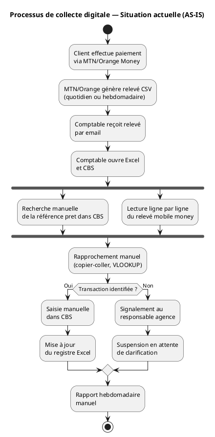

#### TO-BE (situation cible avec le pipeline)

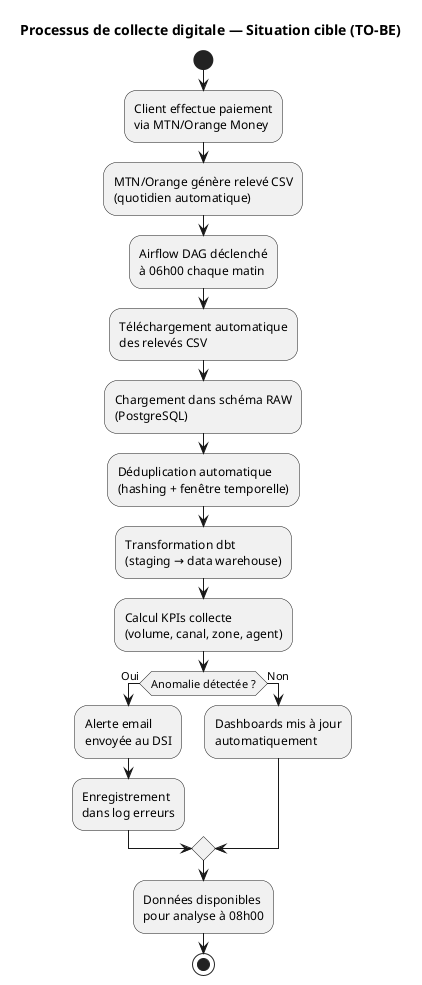

---

### 3.2 Diagramme d'activité — Processus de recouvrement

#### AS-IS

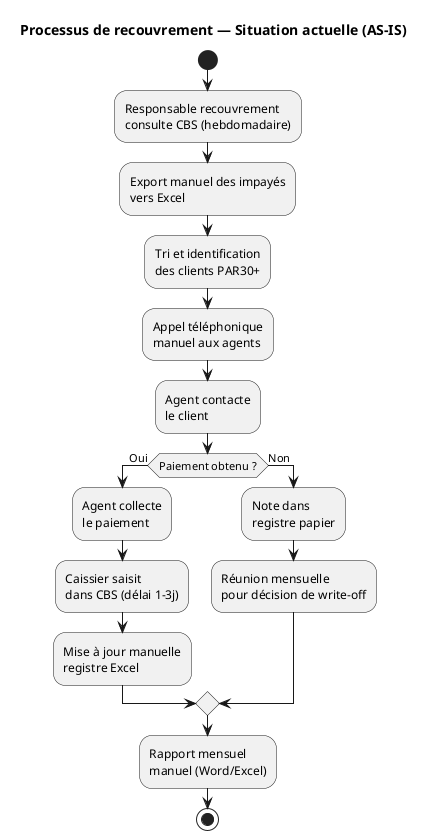

#### TO-BE

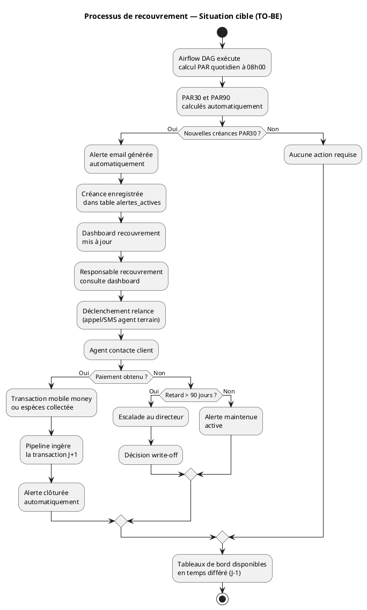

---

### 3.3 Diagramme d'activité — Pipeline d'ingestion quotidien

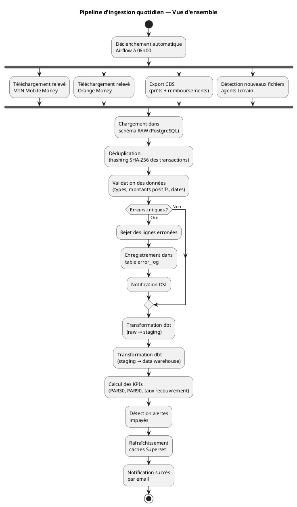

---

## 4. Diagrammes Use Case

### 4.1 Use Case Global (vue d'ensemble)

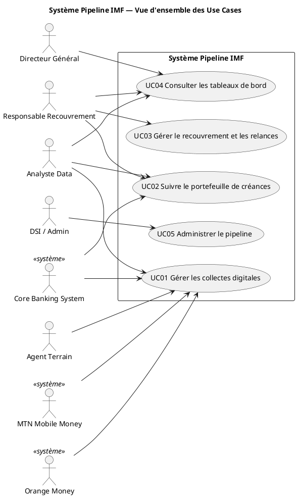

---

### 4.2 UC01 — Gestion des collectes digitales (détaillé)

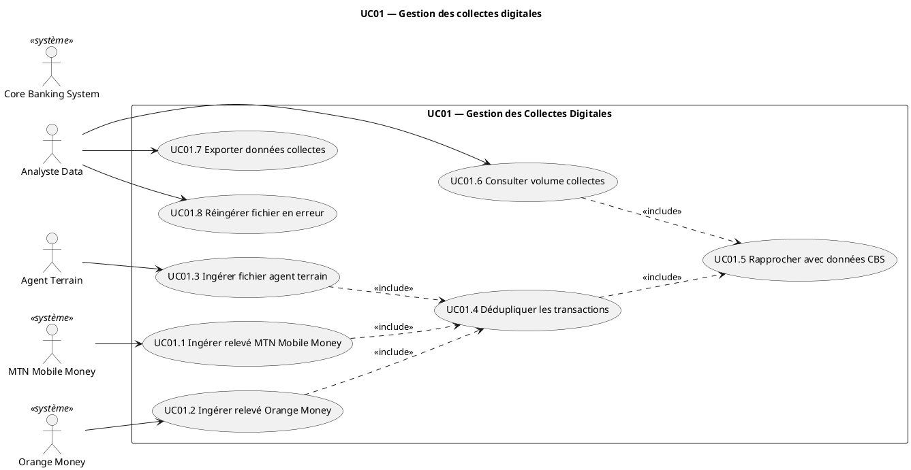

---

### 4.3 UC02 — Suivi du portefeuille de créances (détaillé)

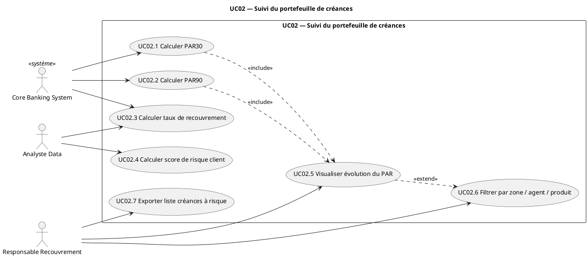

---

### 4.4 UC03 — Recouvrement et relances (détaillé)

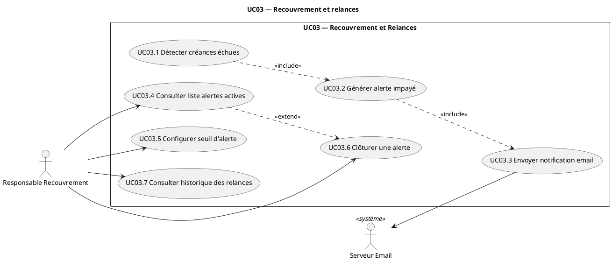

---

### 4.5 UC04 — Reporting et tableaux de bord (détaillé)

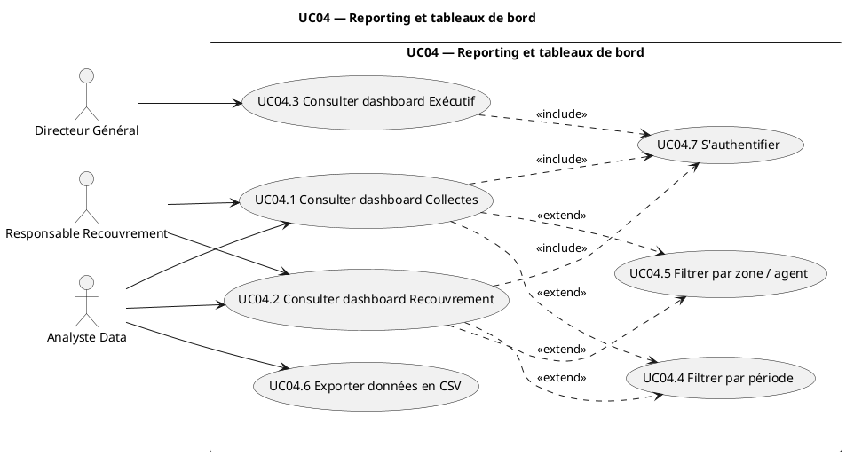

---

### 4.6 UC05 — Administration du pipeline (détaillé)

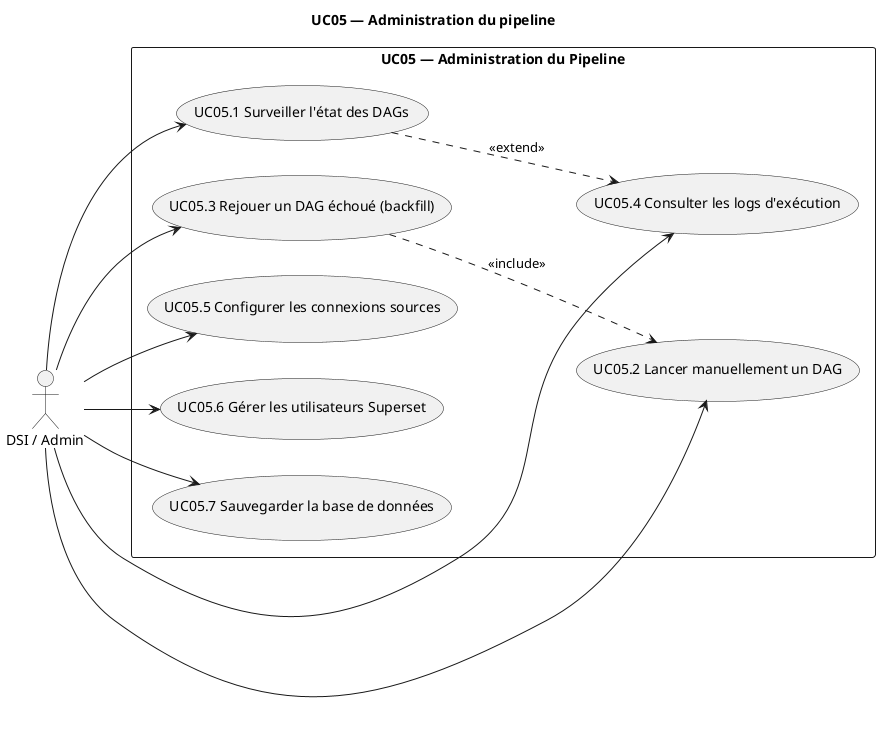

---

## 5. Matrice de traçabilité

### Besoins fonctionnels ↔ Use Cases

| Besoin fonctionnel | UC01 | UC02 | UC03 | UC04 | UC05 |
|---|:---:|:---:|:---:|:---:|:---:|
| BF01 — Ingérer CSV MTN/Orange | ✓ | | | | |
| BF02 — Connexion CBS | ✓ | ✓ | | | |
| BF03 — Déduplication transactions | ✓ | | | | |
| BF04 — Journaliser ingestions | ✓ | | | | ✓ |
| BF05 — Notifier DSI en cas d'échec | | | | | ✓ |
| BF06 — Réingestion manuelle | | | | | ✓ |
| BF07 — Calcul PAR30 | | ✓ | | | |
| BF08 — Calcul PAR90 | | ✓ | | | |
| BF09 — Taux recouvrement | | ✓ | | | |
| BF10 — Volume collectes par canal | ✓ | | | ✓ | |
| BF11 — Taux de défaut mensuel | | ✓ | | ✓ | |
| BF12 — Score de risque client | | ✓ | ✓ | | |
| BF13 — Alerte créance > 30j | | | ✓ | | |
| BF14 — Email alerte recouvrement | | | ✓ | | |
| BF15 — Configuration seuil alerte | | | ✓ | | |
| BF16 — Historique alertes | | | ✓ | ✓ | |
| BF17 — Dashboard Collectes | | | | ✓ | |
| BF18 — Dashboard Recouvrement | | | | ✓ | |
| BF19 — Dashboard Exécutif | | | | ✓ | |
| BF20 — Filtrage dashboards | | | | ✓ | |
| BF21 — Export CSV | | | | ✓ | |
| BF22 — Lancement manuel DAG | | | | | ✓ |
| BF23 — Surveillance état traitements | | | | | ✓ |
| BF24 — Backfill / Replay | | | | | ✓ |
| BF25 — Journalisation exécutions | | | | | ✓ |

### Acteurs ↔ Use Cases

| Acteur | UC01 | UC02 | UC03 | UC04 | UC05 |
|---|:---:|:---:|:---:|:---:|:---:|
| Directeur Général | | | | ✓ | |
| Responsable Recouvrement | | ✓ | ✓ | ✓ | |
| Analyste Data | ✓ | ✓ | | ✓ | |
| DSI / Admin | | | | | ✓ |
| Agent Terrain | ✓ | | | | |
| CBS (système) | ✓ | ✓ | | | |
| MTN Mobile Money (système) | ✓ | | | | |
| Orange Money (système) | ✓ | | | | |
