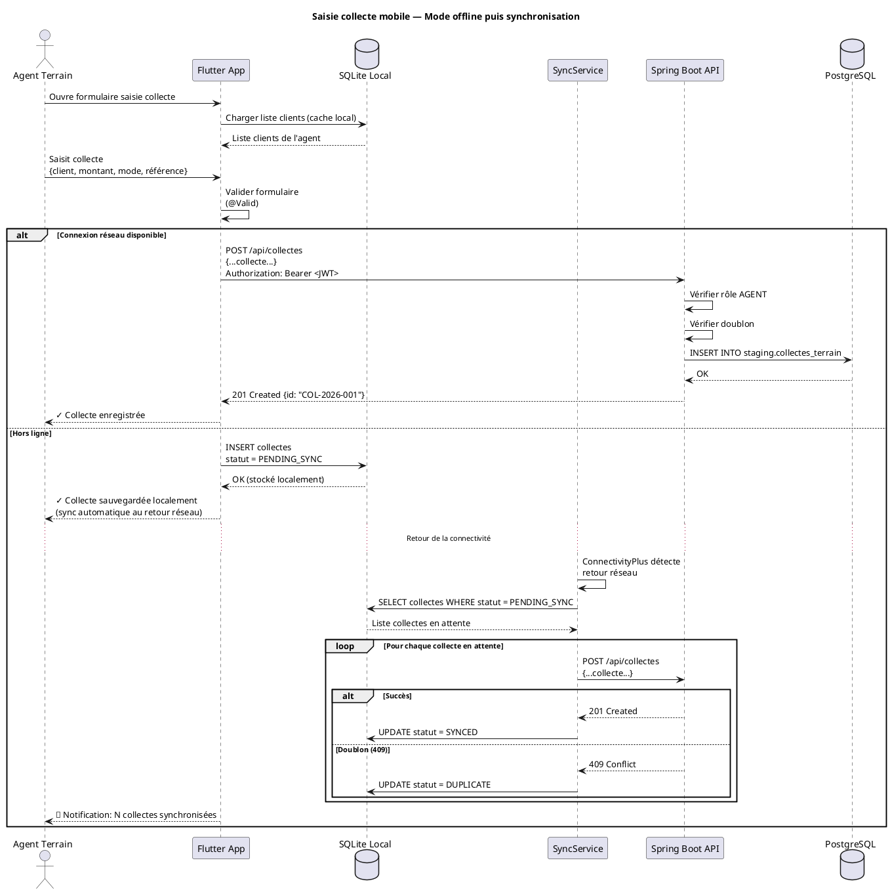
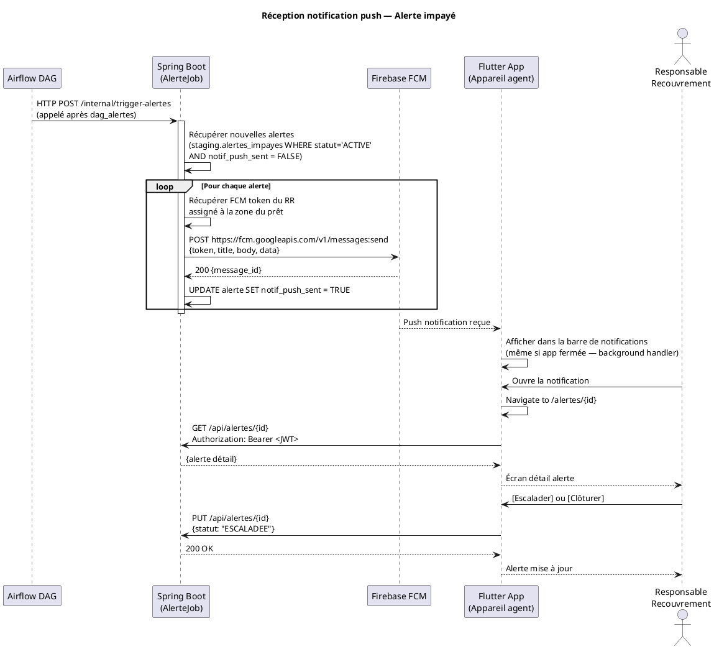
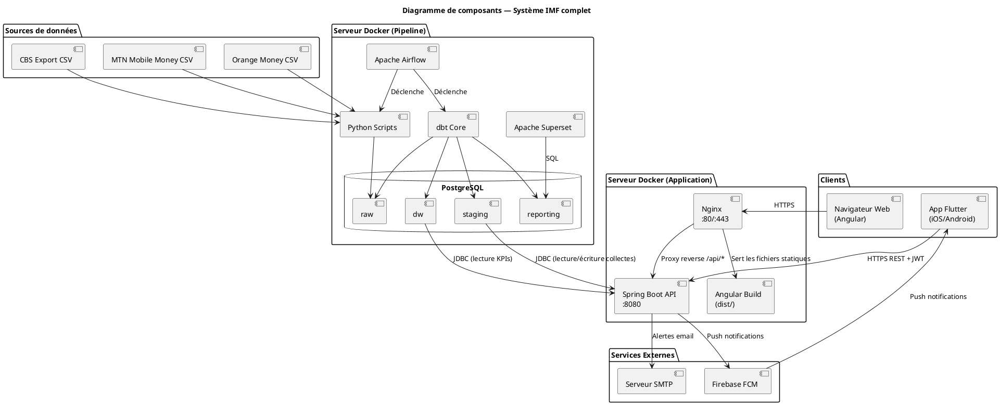

# ARCHITECTURE DU SYSTÈME COMPLET
## Plateforme IMF — Pipeline · Backend Spring Boot · Angular · Flutter

---

| Champ | Valeur |
|---|---|
| **Document** | Architecture Système Complet (ARCH-SYS) |
| **Version** | 1.0 |
| **Auteur** | Étudiant Ingénieur 4 — Institut Universitaire Saint Jean |
| **Date** | 2026-03-31 |
| **Statut** | Draft |

---

## TABLE DES MATIÈRES

1. [Vue d'ensemble de la plateforme](#1-vue-densemble-de-la-plateforme)
2. [Architecture globale (4 couches)](#2-architecture-globale-4-couches)
3. [Backend API — Spring Boot](#3-backend-api--spring-boot)
4. [Application Web — Angular](#4-application-web--angular)
5. [Application Mobile — Flutter](#5-application-mobile--flutter)
6. [Sécurité et authentification (JWT)](#6-sécurité-et-authentification-jwt)
7. [Communication entre couches](#7-communication-entre-couches)
8. [Diagrammes UML complémentaires](#8-diagrammes-uml-complémentaires)

---

## 1. Vue d'ensemble de la plateforme

La plateforme est développée par une **startup tech** et commercialisée comme solution SaaS multi-tenant auprès des institutions de microfinance camerounaises.

Elle est composée de **quatre couches** indépendantes mais intégrées :

```
┌─────────────────────────────────────────────────────────────────────┐
│                         SOURCES DE DONNÉES                          │
│   [CBS Export]   [MTN Mobile Money]   [Orange Money]   [Agents]    │
└───────────────────────────┬─────────────────────────────────────────┘
                            │ Ingestion Python (Airflow DAGs)
┌───────────────────────────▼─────────────────────────────────────────┐
│                    COUCHE 1 — PIPELINE DE DONNÉES                   │
│  Python · Apache Airflow · dbt Core · PostgreSQL · Apache Superset  │
│  → Calcul KPIs, alertes, Data Warehouse en étoile                   │
└───────────────────────────┬─────────────────────────────────────────┘
                            │ Lecture DW via JDBC/SQL
┌───────────────────────────▼─────────────────────────────────────────┐
│                    COUCHE 2 — BACKEND API                           │
│  Spring Boot 3 (Java 17) · Spring Security · JWT · JPA/Hibernate   │
│  Spring Data JPA · Swagger/OpenAPI · Firebase Admin SDK             │
│  → API REST sécurisée, authentification, push notifications         │
└──────────────┬────────────────────────────────┬──────────────────────┘
               │ HTTP REST + JWT                 │ HTTP REST + JWT
┌──────────────▼──────────────┐    ┌─────────────▼──────────────────┐
│  COUCHE 3 — FRONTEND WEB   │    │  COUCHE 4 — FRONTEND MOBILE    │
│  Angular 17 · TypeScript   │    │  Flutter 3 · Dart               │
│  Angular Material · Chart.js│    │  Provider/Riverpod              │
│  Nginx (production)        │    │  Firebase Messaging (FCM)       │
│  → Dashboard web complet   │    │  SQLite (offline) · Dio (HTTP)  │
└─────────────────────────────┘    └────────────────────────────────┘
```

---

## 2. Architecture globale (4 couches)

### 2.1 Responsabilités par couche

| Couche | Ce qu'elle fait | Ce qu'elle ne fait PAS |
|---|---|---|
| **Pipeline** | Ingestion, déduplication, transformation, calcul PAR/KPIs, alertes email | Exposer des APIs HTTP, gérer des utilisateurs |
| **Backend Spring Boot** | Authentification JWT, exposer APIs REST, envoyer push FCM, écrire les collectes terrain dans la DB | Calculer les KPIs (c'est le rôle du pipeline) |
| **Angular** | Interface graphique web (dashboards, gestion), consommer l'API | Calculer quoi que ce soit, accéder directement à la DB |
| **Flutter** | Saisie terrain, consultation mobile KPIs, réception push | Accéder à la DB directement, calculer les KPIs |

### 2.2 Flux de données complet

```
FLUX A — Pipeline quotidien (données sources → DW)
[Sources CSV/Excel] → Airflow → PostgreSQL raw → dbt → PostgreSQL dw → Superset

FLUX B — Consultation KPIs (DW → utilisateurs)
PostgreSQL dw → Spring Boot API → Angular (navigateur web)
PostgreSQL dw → Spring Boot API → Flutter (app mobile)

FLUX C — Saisie collecte terrain (mobile → DB → pipeline)
Flutter (agent) → POST /api/collectes → Spring Boot → PostgreSQL staging
Le pipeline Airflow reprend ces collectes au prochain cycle (J+1)

FLUX D — Alertes (pipeline → mobile)
DAG alertes → staging.alertes_impayes → Spring Boot (cron interne)
→ Firebase FCM → Flutter (push notification) + email SMTP
```

---

## 3. Backend API — Spring Boot

### 3.1 Stack technique

| Composant | Technologie | Version |
|---|---|---|
| Framework | Spring Boot | 3.2+ |
| Langage | Java | 17 (LTS) |
| ORM | Spring Data JPA + Hibernate | Inclus Spring Boot |
| Sécurité | Spring Security + JWT (JJWT) | 0.11+ |
| Documentation API | Springdoc OpenAPI (Swagger UI) | 2.0+ |
| Base de données | PostgreSQL (via Spring Data JPA) | 15+ |
| Push Notifications | Firebase Admin SDK | 9.x |
| Build | Maven | 3.9+ |
| Tests | JUnit 5 + Mockito | Inclus Spring Boot |
| Containerisation | Docker | — |

### 3.2 Architecture interne Spring Boot (Layered Architecture)

```
┌─────────────────────────────────────────┐
│         COUCHE PRÉSENTATION             │
│  @RestController (Controllers)          │
│  DTOs Request/Response                  │
│  Validation (@Valid, @NotNull)          │
│  Swagger/OpenAPI annotations            │
└──────────────────┬──────────────────────┘
                   │
┌──────────────────▼──────────────────────┐
│         COUCHE SERVICE                  │
│  @Service (Business Logic)              │
│  Calculs de présentation                │
│  Gestion des transactions (@Transactional)
│  Intégration Firebase FCM               │
└──────────────────┬──────────────────────┘
                   │
┌──────────────────▼──────────────────────┐
│         COUCHE REPOSITORY               │
│  @Repository (Spring Data JPA)          │
│  Interfaces JpaRepository<Entity, ID>   │
│  Requêtes JPQL / @Query                 │
│  Lecture schéma DW (read-only)          │
│  Écriture schéma staging (collectes)    │
└──────────────────┬──────────────────────┘
                   │
┌──────────────────▼──────────────────────┐
│         BASE DE DONNÉES                 │
│  PostgreSQL — schémas dw + staging      │
└─────────────────────────────────────────┘
```

### 3.3 Structure des packages

```
com.startup.imf/
├── config/
│   ├── SecurityConfig.java         # Spring Security + JWT filter
│   ├── JwtConfig.java              # Paramètres JWT (secret, expiration)
│   ├── SwaggerConfig.java          # Springdoc OpenAPI config
│   └── FirebaseConfig.java         # Firebase Admin SDK init
│
├── controller/
│   ├── AuthController.java         # POST /api/auth/login, /api/auth/refresh
│   ├── CollecteController.java     # GET/POST /api/collectes
│   ├── PretController.java         # GET /api/prets, /api/prets/{id}
│   ├── AlerteController.java       # GET/PUT /api/alertes
│   ├── KpiController.java          # GET /api/kpi/par, /api/kpi/recouvrement
│   ├── ClientController.java       # GET /api/clients
│   ├── AgentController.java        # GET /api/agents
│   └── UserController.java         # CRUD /api/users (admin seulement)
│
├── service/
│   ├── AuthService.java
│   ├── CollecteService.java
│   ├── KpiService.java
│   ├── AlerteService.java
│   ├── NotificationService.java    # Envoi FCM push notifications
│   └── UserService.java
│
├── repository/
│   ├── CollecteRepository.java
│   ├── PretRepository.java
│   ├── AlerteRepository.java
│   ├── KpiParRepository.java       # Lecture fact_par_quotidien (DW)
│   ├── ClientRepository.java
│   └── UserRepository.java
│
├── entity/
│   ├── Collecte.java
│   ├── Pret.java
│   ├── Alerte.java
│   ├── Client.java
│   ├── Agent.java
│   ├── FactParQuotidien.java       # Entité read-only sur DW
│   └── User.java                   # Utilisateurs de la plateforme
│
├── dto/
│   ├── request/
│   │   ├── LoginRequest.java
│   │   ├── CollecteRequest.java
│   │   └── AlerteUpdateRequest.java
│   └── response/
│       ├── AuthResponse.java       # JWT tokens
│       ├── CollecteResponse.java
│       ├── KpiParResponse.java
│       ├── AlerteResponse.java
│       └── DashboardSummaryResponse.java
│
├── security/
│   ├── JwtTokenProvider.java       # Génération / validation JWT
│   ├── JwtAuthenticationFilter.java
│   └── UserDetailsServiceImpl.java
│
└── ImsApplication.java             # Point d'entrée Spring Boot
```

### 3.4 Endpoints API REST (principaux)

| Méthode | Endpoint | Rôles autorisés | Description |
|---|---|---|---|
| POST | `/api/auth/login` | Public | Authentification → JWT |
| POST | `/api/auth/refresh` | Authentifié | Rafraîchir le JWT |
| GET | `/api/kpi/par` | DIRECTEUR, ANALYSTE, RR | PAR30/PAR90 par période/zone |
| GET | `/api/kpi/recouvrement` | DIRECTEUR, ANALYSTE, RR | Taux de recouvrement |
| GET | `/api/kpi/collectes` | DIRECTEUR, ANALYSTE, RR | Volume collectes digitales |
| GET | `/api/kpi/dashboard-summary` | DIRECTEUR | Synthèse exécutive |
| GET | `/api/collectes` | RR, ANALYSTE, AGENT | Liste des collectes |
| POST | `/api/collectes` | AGENT | Saisie d'une collecte (mobile) |
| GET | `/api/prets` | RR, ANALYSTE | Liste des prêts |
| GET | `/api/prets/{id}` | RR, ANALYSTE, AGENT | Détail d'un prêt |
| GET | `/api/alertes` | RR, DIRECTEUR | Liste alertes actives |
| PUT | `/api/alertes/{id}` | RR | Clôturer / escalader une alerte |
| GET | `/api/clients` | RR, ANALYSTE, AGENT | Liste des clients |
| GET | `/api/agents` | DSI, RR | Liste des agents |
| GET | `/api/users` | DSI | Gestion des utilisateurs |
| POST | `/api/users` | DSI | Créer un utilisateur |

### 3.5 Modèle de sécurité JWT

```
Client (Angular/Flutter)          Spring Boot
        │                              │
        │── POST /api/auth/login ──────►│
        │   {username, password}        │ Vérification bcrypt
        │                              │ Génération JWT (15min) + Refresh (7j)
        │◄── 200 {accessToken, refreshToken}
        │                              │
        │── GET /api/kpi/par ──────────►│
        │   Authorization: Bearer <JWT> │ JwtAuthenticationFilter
        │                              │ Validation signature + expiration
        │                              │ Extraction rôle → SecurityContext
        │◄── 200 {data: [...]}         │
        │                              │
        │── POST /api/auth/refresh ────►│ (si JWT expiré)
        │   {refreshToken: "..."}       │
        │◄── 200 {accessToken: "..."}   │
```

### 3.6 Gestion des push notifications (Firebase FCM)

```java
// NotificationService.java — extrait
@Service
public class NotificationService {

    private final FirebaseMessaging firebaseMessaging;

    public void sendAlertePush(String fcmToken, AlerteDto alerte) {
        Message message = Message.builder()
            .setToken(fcmToken)
            .setNotification(Notification.builder()
                .setTitle("ALERTE IMPAYÉ")
                .setBody("Prêt #" + alerte.getPretId()
                    + " — " + alerte.getJoursRetard() + " jours de retard")
                .build())
            .putData("type", "ALERTE_IMPAYE")
            .putData("pret_id", String.valueOf(alerte.getPretId()))
            .putData("jours_retard", String.valueOf(alerte.getJoursRetard()))
            .build();

        firebaseMessaging.sendAsync(message);
    }
}
```

Le token FCM de chaque agent/directeur est stocké lors de la connexion mobile et mis à jour à chaque ouverture de l'application Flutter.

---

## 4. Application Web — Angular

### 4.1 Stack technique

| Composant | Technologie | Version |
|---|---|---|
| Framework | Angular | 17+ |
| Langage | TypeScript | 5+ |
| UI Components | Angular Material | 17+ |
| Graphiques | Chart.js + ng2-charts | 5+ |
| State Management | NgRx (ou Services + RxJS) | 17+ |
| HTTP Client | Angular HttpClient (RxJS) | Natif |
| Authentification | JWT interceptor | — |
| CSS | SCSS + Angular Material theming | — |
| Build | Angular CLI + Nx (optionnel) | — |
| Serveur prod | Nginx | 1.25+ |

### 4.2 Structure des modules Angular

```
src/
├── app/
│   ├── core/                          # Module central (singleton)
│   │   ├── auth/
│   │   │   ├── auth.service.ts        # Login, logout, JWT storage
│   │   │   ├── auth.guard.ts          # Route guard (isAuthenticated)
│   │   │   ├── role.guard.ts          # Route guard (hasRole)
│   │   │   └── jwt.interceptor.ts     # Injecte Authorization: Bearer dans les requêtes
│   │   ├── services/
│   │   │   ├── api.service.ts         # Base URL + méthodes HTTP génériques
│   │   │   ├── kpi.service.ts         # Appels /api/kpi/*
│   │   │   ├── alerte.service.ts      # Appels /api/alertes
│   │   │   └── collecte.service.ts    # Appels /api/collectes
│   │   └── models/
│   │       ├── kpi.model.ts
│   │       ├── alerte.model.ts
│   │       └── user.model.ts
│   │
│   ├── shared/                        # Composants réutilisables
│   │   ├── components/
│   │   │   ├── kpi-card/              # Carte KPI réutilisable
│   │   │   ├── data-table/            # Tableau paginé générique
│   │   │   ├── line-chart/            # Graphique ligne (Chart.js)
│   │   │   ├── bar-chart/             # Graphique barres
│   │   │   └── alert-badge/           # Badge d'alerte
│   │   └── pipes/
│   │       ├── currency-xaf.pipe.ts   # Formatage monnaie XAF
│   │       └── date-fr.pipe.ts        # Formatage dates en français
│   │
│   ├── features/
│   │   ├── auth/
│   │   │   └── login/login.component.ts
│   │   │
│   │   ├── dashboard-collectes/       # UC04.1
│   │   │   ├── collectes.component.ts
│   │   │   ├── collectes.component.html
│   │   │   └── collectes-routing.module.ts
│   │   │
│   │   ├── dashboard-recouvrement/    # UC04.2
│   │   │   ├── recouvrement.component.ts
│   │   │   └── recouvrement.component.html
│   │   │
│   │   ├── dashboard-executif/        # UC04.3
│   │   │   └── executif.component.ts
│   │   │
│   │   ├── alertes/                   # UC03
│   │   │   └── alertes.component.ts
│   │   │
│   │   └── admin/                     # UC05 (DSI seulement)
│   │       ├── users/
│   │       └── pipeline-status/
│   │
│   ├── app-routing.module.ts
│   └── app.module.ts
│
├── environments/
│   ├── environment.ts          # API_URL dev
│   └── environment.prod.ts    # API_URL prod
└── assets/
```

### 4.3 Routing et contrôle d'accès

```typescript
// app-routing.module.ts
const routes: Routes = [
  { path: 'login', component: LoginComponent },
  {
    path: '',
    canActivate: [AuthGuard],
    children: [
      {
        path: 'collectes',
        loadChildren: () => import('./features/dashboard-collectes/...'),
        canActivate: [RoleGuard],
        data: { roles: ['DIRECTEUR', 'ANALYSTE', 'RESPONSABLE_RECOUVREMENT'] }
      },
      {
        path: 'recouvrement',
        loadChildren: () => import('./features/dashboard-recouvrement/...'),
        canActivate: [RoleGuard],
        data: { roles: ['DIRECTEUR', 'RESPONSABLE_RECOUVREMENT'] }
      },
      {
        path: 'executif',
        loadChildren: () => import('./features/dashboard-executif/...'),
        canActivate: [RoleGuard],
        data: { roles: ['DIRECTEUR'] }
      },
      {
        path: 'alertes',
        loadChildren: () => import('./features/alertes/...'),
        canActivate: [RoleGuard],
        data: { roles: ['DIRECTEUR', 'RESPONSABLE_RECOUVREMENT'] }
      },
      {
        path: 'admin',
        loadChildren: () => import('./features/admin/...'),
        canActivate: [RoleGuard],
        data: { roles: ['DSI'] }
      }
    ]
  },
  { path: '**', redirectTo: 'collectes' }
];
```

### 4.4 Maquettes des écrans principaux

#### Écran Dashboard Collectes
```
┌────────────────────────────────────────────────────────────────┐
│ [Logo IMF]  Plateforme IMF   [Utilisateur ▼]  [Déconnexion]   │
├────────────────────────────────────────────────────────────────┤
│ ← Collectes | Recouvrement | Exécutif | Alertes | Admin       │
├──────────────┬────────────────────────────────────────────────┤
│ Filtres :    │  ┌──────────┐ ┌──────────┐ ┌──────────┐        │
│ Période ▼   │  │ 1 245    │ │ 87,3 M   │ │ 68%      │        │
│ Zone ▼      │  │ Collectes│ │ XAF Total│ │ Mobile   │        │
│ Agent ▼     │  └──────────┘ └──────────┘ └──────────┘        │
│ Canal ▼     │                                                  │
│             │  [Graphique : Volume collectes / jour - 30j]    │
│ [Appliquer] │                                                  │
│             ├────────────────────────────────────────────────┤
│             │  [Barres : Collectes par canal (MTN/Orange/Cash)]│
│             │                                                  │
│             ├────────────────────────────────────────────────┤
│             │  [Tableau : Top 10 agents par volume collecté]  │
│             │  Agent | Zone | Nb collectes | Montant | %      │
│             │  [Export CSV]                                    │
└─────────────┴────────────────────────────────────────────────┘
```

#### Écran Dashboard Recouvrement
```
┌────────────────────────────────────────────────────────────────┐
│ DASHBOARD RECOUVREMENT                          [Période ▼]   │
├───────────────────────────────────────────────────────────────┤
│ ┌──────────┐ ┌──────────┐ ┌──────────┐ ┌──────────┐          │
│ │ PAR30    │ │ PAR90    │ │ Alertes  │ │ Taux     │          │
│ │ 8,3 %   │ │ 3,1 %   │ │ 47 act.  │ │ Recouv.  │          │
│ │ ▲ +0,5% │ │ ▼ -0,2% │ │ 🔴       │ │ 91,7 %   │          │
│ └──────────┘ └──────────┘ └──────────┘ └──────────┘          │
│                                                                │
│ [Graphique courbe : Évolution PAR30 et PAR90 sur 90 jours]   │
│                                                                │
│ ALERTES ACTIVES                              [Voir toutes →]  │
│ ┌────────────────────────────────────────────────────────────┐│
│ │ Client      │ Jours retard │ Montant dû   │ Agent │ Action ││
│ │ KAMGA Jean  │ 45 j 🟠      │ 125 000 XAF  │ ATEBA │[Clôt] ││
│ │ NKENG Marie │ 92 j 🔴      │ 340 000 XAF  │ BIYA  │[Escal]││
│ └────────────────────────────────────────────────────────────┘│
└────────────────────────────────────────────────────────────────┘
```

---

## 5. Application Mobile — Flutter

### 5.1 Stack technique

| Composant | Technologie | Version |
|---|---|---|
| Framework | Flutter | 3.19+ |
| Langage | Dart | 3.3+ |
| State Management | Riverpod | 2.x |
| HTTP Client | Dio | 5.x |
| Base locale (offline) | SQLite via sqflite | 2.x |
| Push Notifications | Firebase Messaging (FCM) | 14.x |
| Auth Token Storage | flutter_secure_storage | 9.x |
| Navigation | GoRouter | 13.x |
| Graphiques | fl_chart | 0.68+ |

### 5.2 Structure des modules Flutter

```
lib/
├── main.dart
├── firebase_options.dart           # Auto-généré par FlutterFire CLI
│
├── core/
│   ├── api/
│   │   ├── api_client.dart         # Dio instance + intercepteurs JWT
│   │   ├── auth_interceptor.dart   # Injecte token + gère 401
│   │   └── endpoints.dart          # Constantes URL
│   ├── auth/
│   │   ├── auth_provider.dart      # Riverpod: état d'authentification
│   │   └── token_storage.dart      # flutter_secure_storage
│   ├── database/
│   │   ├── local_db.dart           # SQLite pour mode offline
│   │   └── sync_service.dart       # Synchronisation offline → API
│   └── notifications/
│       └── fcm_service.dart        # Init FCM, gestion tokens, foreground/background
│
├── features/
│   ├── auth/
│   │   └── login_screen.dart
│   │
│   ├── agent/                      # Fonctionnalités agents terrain
│   │   ├── saisie_collecte/
│   │   │   ├── saisie_collecte_screen.dart
│   │   │   ├── saisie_collecte_provider.dart
│   │   │   └── collecte_form.dart
│   │   ├── mes_clients/
│   │   │   └── mes_clients_screen.dart
│   │   └── historique_collectes/
│   │       └── historique_screen.dart
│   │
│   ├── dashboard/                  # KPIs pour directeur / RR
│   │   ├── dashboard_screen.dart
│   │   ├── kpi_card_widget.dart
│   │   ├── par_chart_widget.dart   # Graphique PAR30/PAR90 (fl_chart)
│   │   └── dashboard_provider.dart
│   │
│   └── alertes/
│       ├── alertes_screen.dart
│       └── alerte_detail_screen.dart
│
├── shared/
│   ├── widgets/
│   │   ├── loading_widget.dart
│   │   ├── error_widget.dart
│   │   └── amount_text.dart        # Formatage XAF
│   └── theme/
│       └── app_theme.dart
│
└── router/
    └── app_router.dart             # GoRouter config + guards
```

### 5.3 Mode hors-ligne (offline-first)

L'application Flutter doit fonctionner en zones à faible connectivité (zones rurales camerounaises) :

```
STRATÉGIE OFFLINE-FIRST

1. À l'ouverture de l'app (avec réseau) :
   - Télécharger la liste des clients de l'agent → SQLite local
   - Télécharger les créances assignées → SQLite local

2. En mode hors-ligne :
   - L'agent saisit une collecte → Stockée dans SQLite local
   - marquée "statut = PENDING_SYNC"

3. Au retour de la connectivité :
   - SyncService détecte la reconnexion (ConnectivityPlus)
   - POST /api/collectes pour chaque collecte PENDING_SYNC
   - Si succès → statut = SYNCED
   - Si erreur → statut = SYNC_ERROR + notification agent

4. Conflits :
   - Résolution : le serveur est source de vérité
   - Rejet de la collecte si doublon détecté par le backend
```

```dart
// sync_service.dart — extrait
class SyncService {
  final ApiClient _api;
  final LocalDb _db;

  Future<void> syncPendingCollectes() async {
    final pending = await _db.getPendingCollectes();
    for (final collecte in pending) {
      try {
        await _api.post('/api/collectes', data: collecte.toJson());
        await _db.updateCollecteStatus(collecte.id, SyncStatus.synced);
      } on DioException catch (e) {
        if (e.response?.statusCode == 409) {
          // Doublon détecté par le backend
          await _db.updateCollecteStatus(collecte.id, SyncStatus.duplicate);
        } else {
          await _db.updateCollecteStatus(collecte.id, SyncStatus.syncError);
        }
      }
    }
  }
}
```

### 5.4 Maquettes des écrans Flutter

#### Écran Saisie Collecte (Agent)
```
┌─────────────────────────────┐
│ ← Nouvelle collecte    👤   │
├─────────────────────────────┤
│                             │
│ Client *                    │
│ [🔍 Rechercher client...]   │
│                             │
│ Référence prêt              │
│ [PRET-2025-001234      ▼]  │
│                             │
│ Montant (XAF) *             │
│ [    125 000              ] │
│                             │
│ Mode de paiement *          │
│ ● MTN Mobile Money          │
│ ○ Orange Money              │
│ ○ Espèces                   │
│                             │
│ Référence transaction       │
│ [REF-MTN-XXXXXXXX        ] │
│                             │
│ Observation (optionnel)     │
│ [                         ] │
│                             │
│ [  ENREGISTRER COLLECTE  ] │
│ (sera synchronisé si hors ligne)
└─────────────────────────────┘
```

#### Écran Dashboard Mobile (Directeur)
```
┌─────────────────────────────┐
│ Tableau de bord    [⚙] [🔔3]│
├─────────────────────────────┤
│ Bonjour, M. Directeur       │
│ Dernière MàJ : 08h30        │
├─────────────────────────────┤
│ ┌───────────┐ ┌───────────┐ │
│ │ PAR30     │ │ PAR90     │ │
│ │  8,3 %   │ │  3,1 %   │ │
│ │ ▲ +0,5%  │ │ ▲ +0,1%  │ │
│ └───────────┘ └───────────┘ │
│                             │
│ ┌───────────┐ ┌───────────┐ │
│ │ Collectes │ │ Taux Rec. │ │
│ │ 87,3 M   │ │  91,7 %  │ │
│ │ XAF/mois  │ │          │ │
│ └───────────┘ └───────────┘ │
│                             │
│ [Graphique PAR - 30 jours]  │
│  ╭╮   ╭─╮                  │
│ ─╯╰───╯ ╰──────            │
│                             │
│ Alertes actives : 47 🔴     │
│ [Voir les alertes →]        │
└─────────────────────────────┘
```

---

## 6. Sécurité et authentification (JWT)

### 6.1 Schéma JWT

```
Structure du JWT :
Header : { "alg": "HS256", "typ": "JWT" }
Payload : {
  "sub": "user_id",
  "username": "jkamga",
  "role": "AGENT",
  "imf_id": "IMF-CM-001",    // Multi-tenant : identifiant de l'IMF
  "fcm_token": "...",        // Token Firebase de l'appareil
  "iat": 1711900000,
  "exp": 1711900900          // 15 minutes
}
Signature : HMACSHA256(base64(header) + "." + base64(payload), SECRET_KEY)

Refresh Token :
- Durée : 7 jours
- Stocké côté serveur (table refresh_tokens) + côté client (SecureStorage Flutter / localStorage Angular)
- Révocable (blacklist en cas de déconnexion)
```

### 6.2 Matrice de contrôle d'accès (RBAC)

| Ressource | DIRECTEUR | RR | ANALYSTE | DSI | AGENT |
|---|:---:|:---:|:---:|:---:|:---:|
| GET /api/kpi/par | ✓ | ✓ | ✓ | | |
| GET /api/kpi/collectes | ✓ | ✓ | ✓ | | |
| GET /api/kpi/dashboard-summary | ✓ | | | | |
| GET /api/alertes | ✓ | ✓ | | | |
| PUT /api/alertes/{id} | | ✓ | | | |
| POST /api/collectes | | | | | ✓ |
| GET /api/collectes (toutes) | ✓ | ✓ | ✓ | | |
| GET /api/collectes (ses collectes) | | | | | ✓ |
| GET /api/prets | | ✓ | ✓ | | ✓ |
| GET /api/clients | | ✓ | ✓ | | ✓ |
| GET /api/users | | | | ✓ | |
| POST /api/users | | | | ✓ | |

---

## 7. Communication entre couches

### 7.1 Protocoles et formats

| Communication | Protocole | Format | Auth |
|---|---|---|---|
| Angular ↔ Spring Boot | HTTPS REST | JSON | JWT Bearer |
| Flutter ↔ Spring Boot | HTTPS REST | JSON | JWT Bearer |
| Spring Boot ↔ PostgreSQL | JDBC (port 5432) | SQL | User/Password |
| Spring Boot → Firebase FCM | HTTPS (Google API) | JSON | Service Account |
| Airflow → PostgreSQL | JDBC (port 5432) | SQL | User/Password |
| dbt → PostgreSQL | JDBC (port 5432) | SQL | User/Password |
| Airflow → SMTP | SMTP (port 587) | — | STARTTLS |

### 7.2 Gestion des erreurs API

```json
// Format standard de réponse d'erreur (Spring Boot @ControllerAdvice)
{
  "timestamp": "2026-03-31T08:30:00Z",
  "status": 400,
  "error": "BAD_REQUEST",
  "message": "Le montant de la collecte doit être positif",
  "path": "/api/collectes",
  "requestId": "abc123"
}

// Codes HTTP utilisés :
// 200 OK         — Succès avec données
// 201 Created    — Ressource créée (POST)
// 400 Bad Request — Validation échouée
// 401 Unauthorized — JWT manquant ou expiré
// 403 Forbidden   — Rôle insuffisant
// 404 Not Found   — Ressource introuvable
// 409 Conflict    — Doublon détecté
// 500 Internal Server Error — Erreur serveur (loggée)
```

---

## 8. Diagrammes UML complémentaires

### 8.1 Diagramme de séquence — Saisie de collecte mobile (offline puis sync)



### 8.2 Diagramme de séquence — Réception notification push Flutter



### 8.3 Diagramme de composants — Système complet


