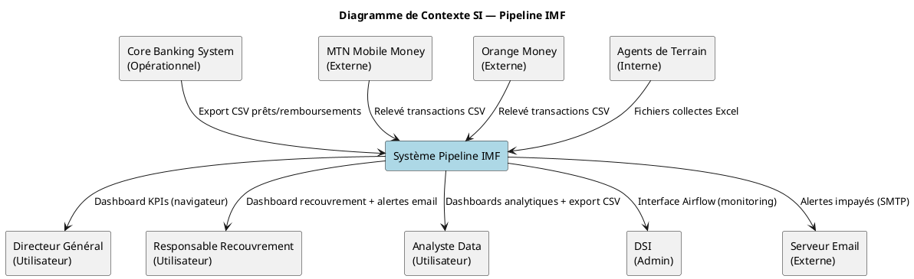
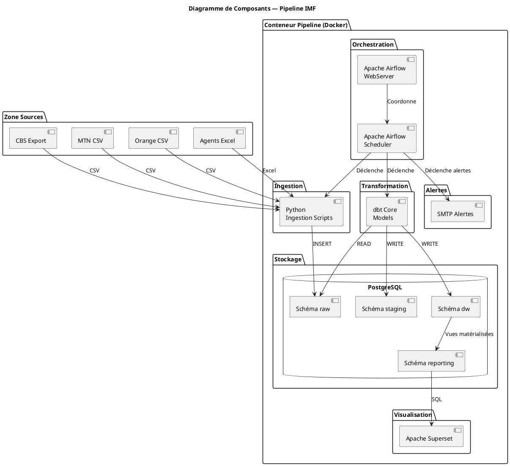
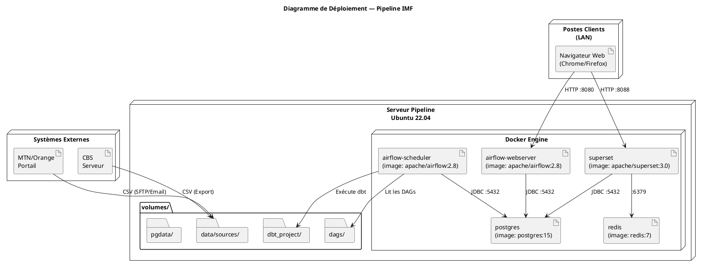

# CAHIER DE CONCEPTION — ARCHITECTURE
## Pipeline de Données — Collectes Digitales & Recouvrement de Créances — IMF Cameroun

---

| Champ | Valeur |
|---|---|
| **Document** | Conception Architecture (CA-ARCH) |
| **Version** | 1.0 |
| **Auteur** | Étudiant Ingénieur 4 — Institut Universitaire Saint Jean |
| **Date** | 2026-03-31 |
| **Statut** | Draft |

---

## TABLE DES MATIÈRES

1. [Architecture Logicielle](#1-architecture-logicielle)
2. [Architecture des Systèmes d'Information](#2-architecture-des-systèmes-dinformation)
3. [Architecture Matérielle](#3-architecture-matérielle)
4. [Diagrammes UML d'architecture](#4-diagrammes-uml-darchitecture)
5. [Plan de sauvegarde et reprise](#5-plan-de-sauvegarde-et-reprise)

---

## 1. Architecture Logicielle

### 1.1 Choix du pattern architectural

#### Analyse des options

| Pattern | Description | Avantages | Inconvénients | Adapté ? |
|---|---|---|---|---|
| **Lambda Architecture** | Couche batch + couche vitesse + couche serving | Robuste, standard industrie | Complexité de maintenance double code | Partiellement |
| **Kappa Architecture** | Tout stream, une seule couche | Simplicité | Nécessite Kafka/Flink, complexité infra | Non (surqualifié) |
| **Pipeline Batch simplifié** | Batch uniquement, orchestré par Airflow | Simple, adapté aux données quotidiennes, maintenable | Pas de temps réel | **Oui — retenu** |
| **ELT sur Data Warehouse** | Chargement d'abord, transformation dans le DW | Traçabilité maximale (dbt) | Stockage plus important | **Oui — retenu** |

#### Décision architecturale

> **Pattern retenu : ELT Batch avec orchestration Airflow**
>
> Justification : Les données sources (mobile money, CBS) sont disponibles avec une latence d'au moins quelques heures. Un traitement en temps réel n'apporte pas de valeur métier supplémentaire face à sa complexité. La fenêtre de traitement nocturne (06h–08h) est suffisante pour que les dashboards soient à jour à l'ouverture des bureaux.

### 1.2 Découpage en couches (Layered Architecture)

```
┌─────────────────────────────────────────────────────────────┐
│                    COUCHE SOURCES                           │
│  [CBS Export]  [MTN CSV]  [Orange CSV]  [Agents Excel]     │
└─────────────────────────┬───────────────────────────────────┘
                          │ Ingestion Python (Airflow DAG)
┌─────────────────────────▼───────────────────────────────────┐
│                    COUCHE RAW                               │
│  PostgreSQL — schéma "raw"                                  │
│  Données brutes, non transformées, archivées 5 ans          │
└─────────────────────────┬───────────────────────────────────┘
                          │ dbt models (staging)
┌─────────────────────────▼───────────────────────────────────┐
│                    COUCHE STAGING                           │
│  PostgreSQL — schéma "staging"                              │
│  Données nettoyées, typées, dédupliquées                    │
└─────────────────────────┬───────────────────────────────────┘
                          │ dbt models (data warehouse)
┌─────────────────────────▼───────────────────────────────────┐
│                    COUCHE DATA WAREHOUSE                    │
│  PostgreSQL — schéma "dw"                                   │
│  Schéma en étoile : facts + dimensions                      │
└─────────────────────────┬───────────────────────────────────┘
                          │ Vues analytiques / API Superset
┌─────────────────────────▼───────────────────────────────────┐
│                    COUCHE SERVING                           │
│  Apache Superset — schéma "reporting"                       │
│  Dashboards, KPIs, alertes, exports CSV                     │
└─────────────────────────────────────────────────────────────┘
```

### 1.3 Description des composants logiciels

#### Apache Airflow (Orchestration)
- **Rôle** : Planifier, déclencher et surveiller les DAGs (pipelines de traitement)
- **Version** : Airflow 2.8+
- **DAGs principaux** :
  - `dag_ingest_mtn` : ingestion relevé MTN Mobile Money (quotidien 06h00)
  - `dag_ingest_orange` : ingestion relevé Orange Money (quotidien 06h10)
  - `dag_ingest_cbs` : ingestion export CBS (quotidien 06h20)
  - `dag_ingest_agents` : ingestion fichiers agents terrain (quotidien 06h30)
  - `dag_transform_dw` : transformation dbt complète (quotidien 07h00)
  - `dag_alertes` : calcul PAR et envoi alertes (quotidien 08h00)
- **Executor** : LocalExecutor (suffisant pour volumes IMF)
- **Backend** : PostgreSQL (métadonnées Airflow)

#### PostgreSQL (Stockage)
- **Rôle** : Base de données centrale (raw + staging + DW + reporting)
- **Version** : PostgreSQL 15+
- **Schémas** :
  - `raw` : données brutes importées
  - `staging` : données nettoyées
  - `dw` : entrepôt analytique (étoile)
  - `reporting` : vues matérialisées pour Superset
  - `airflow` : métadonnées Airflow
  - `superset` : métadonnées Superset

#### dbt Core (Transformation)
- **Rôle** : Transformer les données de raw → staging → dw via des modèles SQL versionnés
- **Version** : dbt-core 1.7+, dbt-postgres adapter
- **Structure** :
  ```
  dbt_project/
  ├── models/
  │   ├── staging/          # stg_mtn_transactions.sql, stg_orange_transactions.sql, etc.
  │   ├── intermediate/     # int_transactions_unifiees.sql
  │   └── marts/            # fact_collectes.sql, fact_remboursements.sql, dim_*.sql
  ├── tests/                # Tests de qualité (not_null, unique, accepted_values)
  └── seeds/                # Données de référence statiques
  ```

#### Apache Superset (Visualisation)
- **Rôle** : Tableaux de bord interactifs, contrôle d'accès, export CSV
- **Version** : Superset 3.0+
- **Dashboards** :
  - Dashboard 1 : Collectes Digitales
  - Dashboard 2 : Recouvrement & PAR
  - Dashboard 3 : KPIs Exécutifs

#### Python (Scripts d'ingestion)
- **Version** : Python 3.11+
- **Bibliothèques principales** :
  - `pandas` : lecture et transformation des CSV/Excel
  - `sqlalchemy` : connexion PostgreSQL
  - `openpyxl` : lecture des fichiers Excel
  - `hashlib` : déduplication par hashing SHA-256
  - `smtplib` : envoi des alertes email
  - `faker` : génération de données simulées

#### Docker & Docker Compose (Containerisation)
- **Rôle** : Isoler et reproductibiliser l'environnement complet
- **Services** :
  - `airflow-webserver` : Interface Airflow
  - `airflow-scheduler` : Planificateur des DAGs
  - `postgres` : Base de données unique PostgreSQL
  - `superset` : Interface de visualisation
  - `redis` : Cache Superset (optionnel)

---

## 2. Architecture des Systèmes d'Information

### 2.1 Cartographie des systèmes

```
┌──────────────────────────────────────────────────────────────────────┐
│                      SYSTÈMES SOURCES (existants)                    │
│                                                                      │
│  ┌──────────────────┐  ┌─────────────────┐  ┌──────────────────┐   │
│  │ Core Banking Sys │  │ MTN Mobile Money│  │  Orange Money    │   │
│  │ (CBS)            │  │ (Portail web /  │  │  (Portail web /  │   │
│  │ Export CSV/Excel │  │  Email CSV)     │  │   Email CSV)     │   │
│  └────────┬─────────┘  └────────┬────────┘  └────────┬─────────┘   │
│           │                     │                     │             │
│  ┌────────┴──────────────────────┴─────────────────────┴──────────┐  │
│  │            Zone de dépôt des fichiers sources                  │  │
│  │        (Dossier partagé réseau / SFTP / Email)                 │  │
│  └─────────────────────────────────────────────────────────────────┘  │
└─────────────────────────────────┬────────────────────────────────────┘
                                  │
                                  ▼ Ingestion automatisée (Airflow)
┌──────────────────────────────────────────────────────────────────────┐
│                      SYSTÈME PIPELINE (nouveau)                      │
│                                                                      │
│  ┌─────────────────────────────────────────────────────────────────┐ │
│  │ Serveur Pipeline (Docker Compose)                               │ │
│  │                                                                 │ │
│  │  ┌────────────┐    ┌────────────┐    ┌────────────────────────┐ │ │
│  │  │  Airflow   │───►│ PostgreSQL │◄───│     dbt Core           │ │ │
│  │  │ (Orches-   │    │ (raw /     │    │ (Transformation SQL)   │ │ │
│  │  │  tration)  │    │  staging / │    └────────────────────────┘ │ │
│  │  └────────────┘    │  dw /      │                               │ │
│  │                    │  reporting)│    ┌────────────────────────┐ │ │
│  │                    └──────┬─────┘    │  Apache Superset       │ │ │
│  │                           └─────────►│  (Dashboards)          │ │ │
│  │                                      └────────────────────────┘ │ │
│  └─────────────────────────────────────────────────────────────────┘ │
└─────────────────────────────────┬────────────────────────────────────┘
                                  │
                                  ▼ Accès utilisateurs
┌──────────────────────────────────────────────────────────────────────┐
│                      SYSTÈMES CIBLES (utilisateurs)                  │
│                                                                      │
│  ┌─────────────────┐  ┌─────────────────┐  ┌──────────────────────┐ │
│  │ Navigateur web  │  │ Serveur Email   │  │   Export CSV         │ │
│  │ (Superset UI)   │  │ (Alertes)       │  │   (Téléchargement)   │ │
│  └─────────────────┘  └─────────────────┘  └──────────────────────┘ │
└──────────────────────────────────────────────────────────────────────┘
```

### 2.2 Flux d'intégration entre systèmes

| # | Source | Cible | Format | Fréquence | Mode |
|---|---|---|---|---|---|
| F01 | CBS | Zone dépôt | CSV (UTF-8) | Quotidien | Export manuel ou cron |
| F02 | MTN Mobile Money | Zone dépôt | CSV | Quotidien | Email automatique ou portail |
| F03 | Orange Money | Zone dépôt | CSV | Quotidien | Email automatique ou portail |
| F04 | Agent terrain | Zone dépôt | Excel .xlsx | Hebdomadaire | Upload manuel |
| F05 | Zone dépôt | PostgreSQL raw | INSERT SQL | Déclenché par Airflow | Automatique |
| F06 | PostgreSQL raw | PostgreSQL dw | SQL (dbt) | Quotidien | Automatique |
| F07 | PostgreSQL dw | Superset | SQL (lecture) | Temps réel (lecture) | API interne |
| F08 | Pipeline alertes | Serveur email | SMTP | Sur événement | Automatique |

### 2.3 Diagramme de contexte SI



---

## 3. Architecture Matérielle

### 3.1 Environnement de développement / test (local)

| Composant | Spécification minimale | Recommandé |
|---|---|---|
| CPU | 4 cœurs (Intel/AMD x64) | 8 cœurs |
| RAM | 8 Go | 16 Go |
| Stockage | 50 Go SSD | 100 Go SSD |
| OS | Ubuntu 22.04 LTS ou Windows 10/11 (Docker Desktop) | Ubuntu 22.04 LTS |
| Réseau | Accès internet (pour téléchargement images Docker) | 10 Mbps minimum |

### 3.2 Environnement de production (serveur IMF)

| Composant | Spécification minimale | Recommandé |
|---|---|---|
| CPU | 4 cœurs serveur | 8 cœurs |
| RAM | 16 Go | 32 Go |
| Stockage OS | 50 Go SSD | 100 Go SSD |
| Stockage données | 200 Go HDD | 500 Go HDD (archivage 5 ans) |
| OS | Ubuntu 22.04 LTS Server | Ubuntu 22.04 LTS Server |
| Réseau | LAN 100 Mbps + accès internet 4 Mbps | Fibre 10 Mbps |
| Alimentation | Onduleur (UPS) 1500 VA | Onduleur 3000 VA |

### 3.3 Schéma réseau

```
                        INTERNET
                            │
                    ┌───────┴────────┐
                    │   Routeur /    │
                    │   Firewall     │
                    │   (NAT, SSL)   │
                    └───────┬────────┘
                            │ LAN 192.168.1.0/24
              ┌─────────────┼──────────────────┐
              │             │                  │
    ┌─────────▼─────────┐  ┌▼──────────────┐  ┌▼──────────────┐
    │  Serveur Pipeline │  │ Poste Admin   │  │ Postes Users  │
    │  192.168.1.10     │  │ (DSI)         │  │ (Directeur,   │
    │  Ubuntu 22.04     │  │ 192.168.1.11  │  │  RR, Analyste)│
    │  Docker Compose   │  └───────────────┘  └───────────────┘
    │                   │
    │  :8080 Airflow UI │
    │  :8088 Superset   │
    │  :5432 PostgreSQL │
    └───────────────────┘
```

### 3.4 Ports et services exposés

| Service | Port interne | Port exposé | Accès |
|---|---|---|---|
| Apache Airflow WebUI | 8080 | 8080 | LAN uniquement |
| Apache Superset | 8088 | 8088 | LAN uniquement |
| PostgreSQL | 5432 | 5432 | Localhost uniquement |
| Redis (cache Superset) | 6379 | Non exposé | Interne Docker uniquement |

---

## 4. Diagrammes UML d'architecture

### 4.1 Diagramme de composants



### 4.2 Diagramme de déploiement



---

## 5. Plan de sauvegarde et reprise

### 5.1 Stratégie de sauvegarde

| Composant | Fréquence | Méthode | Rétention |
|---|---|---|---|
| Base PostgreSQL (schéma dw) | Quotidien à 23h00 | `pg_dump` → fichier .sql.gz | 30 jours |
| Base PostgreSQL (schéma raw) | Hebdomadaire (dimanche) | `pg_dump` → fichier .sql.gz | 6 mois |
| Fichiers sources (CSV/Excel) | Quotidien | Copie vers dossier `data/archives/` | 5 ans (COBAC) |
| Configuration Docker Compose | À chaque modification | Commit Git | Indéfini |
| Code source (DAGs, dbt, scripts) | À chaque modification | Commit Git + push GitHub | Indéfini |
| Configuration Superset (dashboards) | Hebdomadaire | Export JSON Superset | 3 mois |

### 5.2 Procédure de reprise (Plan de Reprise d'Activité)

| Incident | Procédure | RTO estimé |
|---|---|---|
| Échec d'un DAG Airflow | Rejouer le DAG via l'interface Airflow (backfill) | 30 min |
| Corruption base PostgreSQL | Restaurer depuis le dernier pg_dump | 2 heures |
| Crash du serveur | `docker-compose down && docker-compose up -d` | 15 min |
| Perte totale du serveur | Réinstaller Docker, cloner le repo Git, restaurer pg_dump | 4 heures |
| Fichier source corrompu | Réingérer le fichier source corrigé via DAG manuel | 1 heure |

### 5.3 Script de sauvegarde automatique

```bash
#!/bin/bash
# backup_pipeline.sh — à planifier via cron : 0 23 * * * /opt/pipeline/backup_pipeline.sh

DATE=$(date +%Y%m%d_%H%M%S)
BACKUP_DIR="/opt/pipeline/backups"
PGPASSWORD="votre_mot_de_passe"

mkdir -p "$BACKUP_DIR"

# Sauvegarde schémas data warehouse et reporting
pg_dump -h localhost -U pipeline_user -d pipeline_db \
  -n dw -n reporting \
  | gzip > "$BACKUP_DIR/dw_reporting_$DATE.sql.gz"

# Nettoyage sauvegardes > 30 jours
find "$BACKUP_DIR" -name "dw_reporting_*.sql.gz" -mtime +30 -delete

echo "[$DATE] Sauvegarde terminée : $BACKUP_DIR/dw_reporting_$DATE.sql.gz"
```
