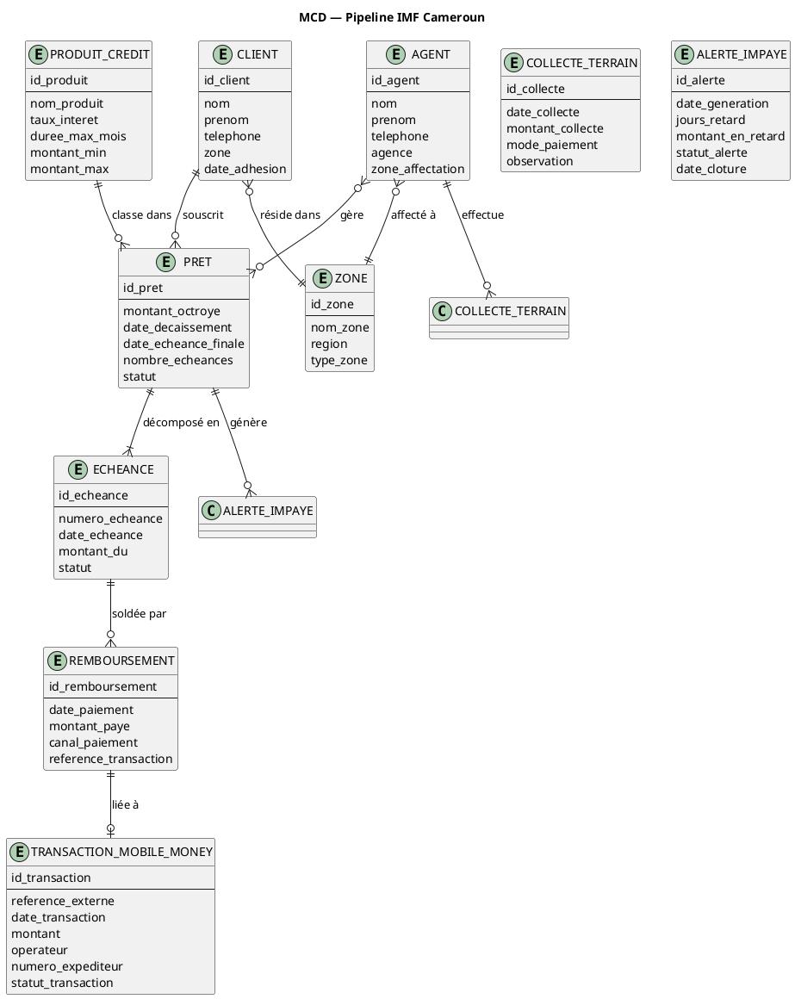
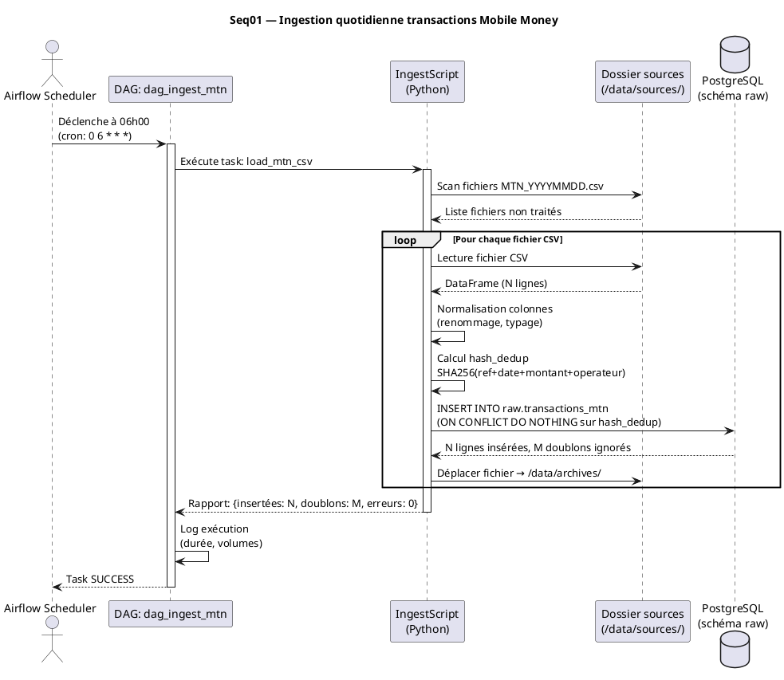
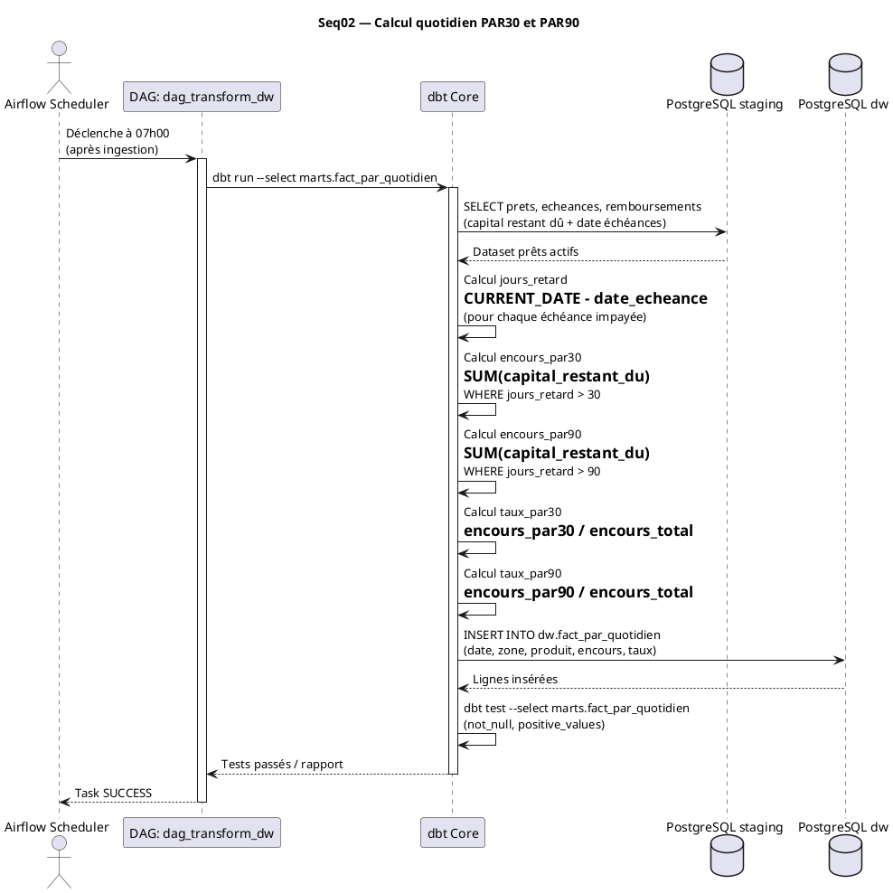
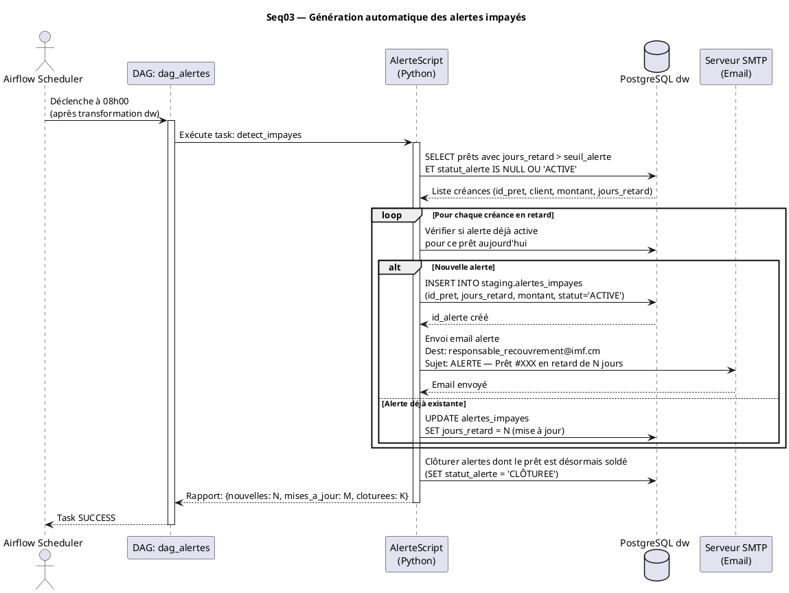
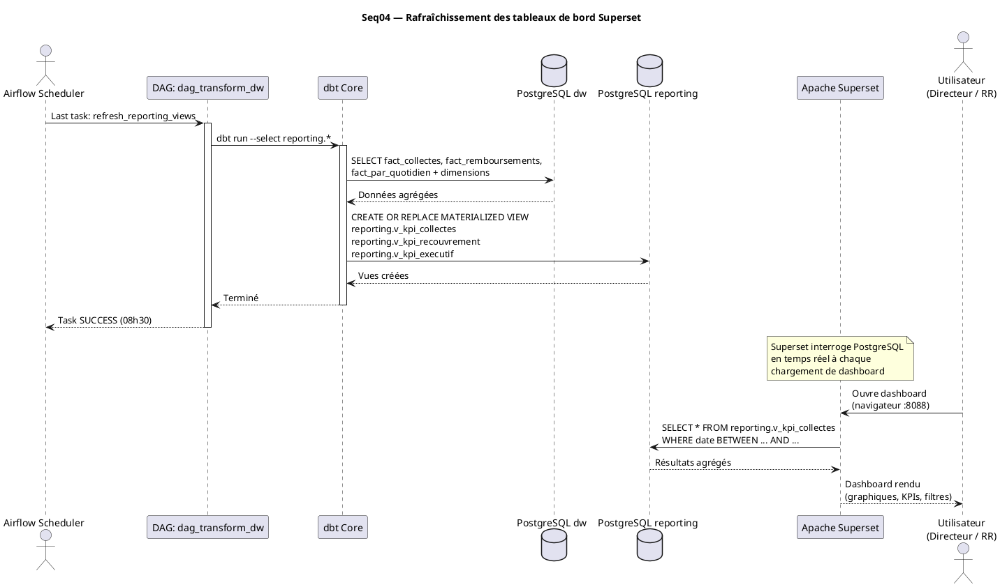
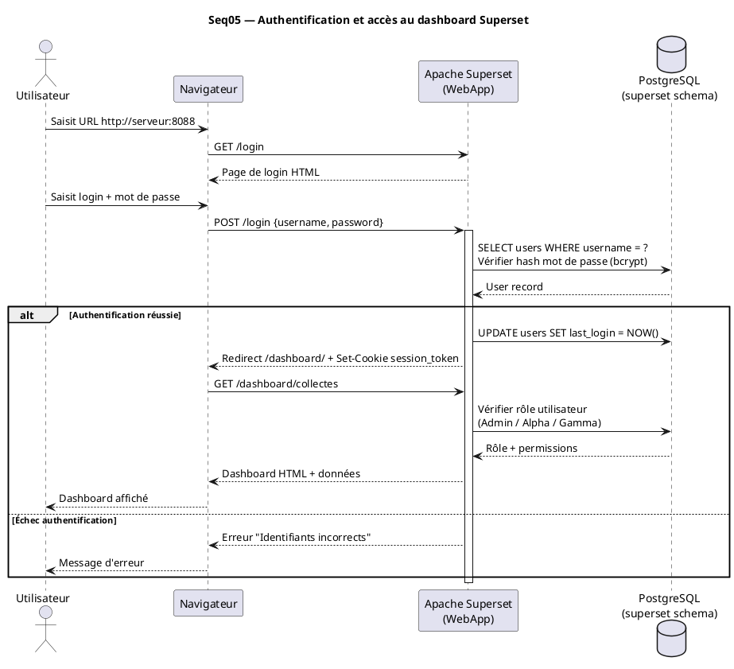
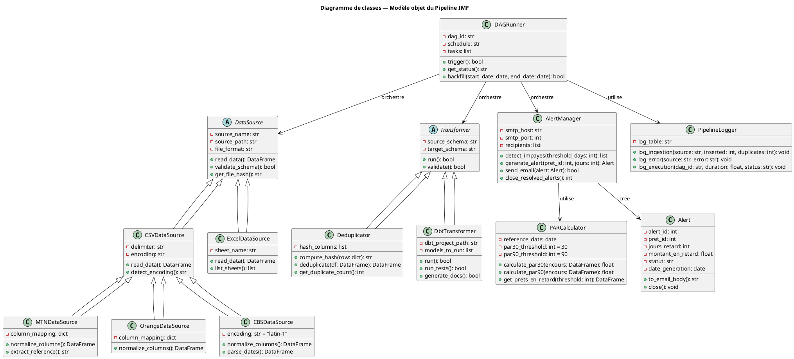
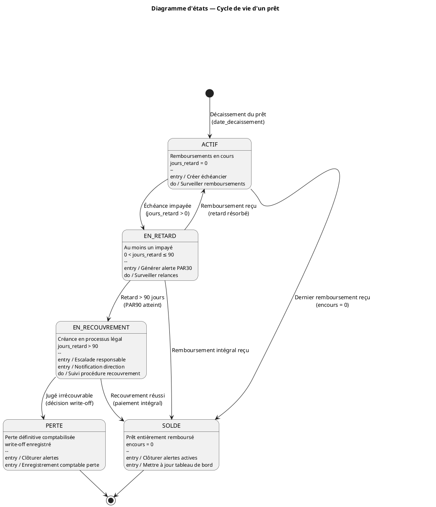

# CAHIER DE CONCEPTION — DONNÉES & DIAGRAMMES UML
## Pipeline de Données — Collectes Digitales & Recouvrement de Créances — IMF Cameroun

---

| Champ | Valeur |
|---|---|
| **Document** | Conception Données & UML (CD-UML) |
| **Version** | 1.0 |
| **Auteur** | Étudiant Ingénieur 4 — Institut Universitaire Saint Jean |
| **Date** | 2026-03-31 |
| **Statut** | Draft |

---

## TABLE DES MATIÈRES

1. [Modèle Conceptuel des Données (MCD)](#1-modèle-conceptuel-des-données-mcd)
2. [Modèle Logique des Données (MLD)](#2-modèle-logique-des-données-mld)
3. [Modèle Physique des Données (MPD)](#3-modèle-physique-des-données-mpd)
4. [Schéma du Data Warehouse (Étoile)](#4-schéma-du-data-warehouse-étoile)
5. [Dictionnaire de données](#5-dictionnaire-de-données)
6. [Diagrammes de séquence UML](#6-diagrammes-de-séquence-uml)
7. [Diagramme de classes UML](#7-diagramme-de-classes-uml)
8. [Diagramme d'états](#8-diagramme-détats)

---

## 1. Modèle Conceptuel des Données (MCD)

### 1.1 Entités et associations



### 1.2 Cardinalités et règles métier

| Association | Cardinalité | Règle métier |
|---|---|---|
| CLIENT — PRET | 1..* — 0..* | Un client peut avoir plusieurs prêts. Un prêt appartient à un seul client. |
| PRODUIT — PRET | 1 — 0..* | Tout prêt est classé dans un produit de crédit. |
| PRET — ECHEANCE | 1 — 1..* | Un prêt est toujours décomposé en au moins une échéance. |
| ECHEANCE — REMBOURSEMENT | 1 — 0..* | Une échéance peut recevoir plusieurs paiements partiels. |
| REMBOURSEMENT — TRANSACTION | 0..1 — 0..1 | Un remboursement peut ou non être lié à une transaction mobile money. |
| AGENT — PRET | 0..* — 0..1 | Un agent peut gérer plusieurs prêts. Un prêt est suivi par un agent. |
| PRET — ALERTE_IMPAYE | 1 — 0..* | Un prêt peut générer plusieurs alertes au fil du temps. |

---

## 2. Modèle Logique des Données (MLD)

### 2.1 Tables opérationnelles (schéma `staging`)

```
zones(id_zone PK, nom_zone, region, type_zone)

clients(id_client PK, nom, prenom, telephone, id_zone FK→zones, date_adhesion)

agents(id_agent PK, nom, prenom, telephone, agence, id_zone FK→zones)

produits_credit(id_produit PK, nom_produit, taux_interet, duree_max_mois,
                montant_min, montant_max)

prets(id_pret PK, id_client FK→clients, id_produit FK→produits_credit,
      id_agent FK→agents, montant_octroye, date_decaissement,
      date_echeance_finale, nombre_echeances, statut)

echeances(id_echeance PK, id_pret FK→prets, numero_echeance, date_echeance,
          montant_du, statut)

transactions_mobile_money(id_transaction PK, reference_externe UNIQUE,
                          date_transaction, montant, operateur,
                          numero_expediteur, statut_transaction, source_fichier)

remboursements(id_remboursement PK, id_echeance FK→echeances,
               id_transaction FK→transactions_mobile_money NULLABLE,
               date_paiement, montant_paye, canal_paiement, reference_transaction)

collectes_terrain(id_collecte PK, id_agent FK→agents, id_pret FK→prets NULLABLE,
                  date_collecte, montant_collecte, mode_paiement, observation)

alertes_impayes(id_alerte PK, id_pret FK→prets, date_generation, jours_retard,
                montant_en_retard, statut_alerte, date_cloture NULLABLE)
```

---

## 3. Modèle Physique des Données (MPD)

### 3.1 DDL SQL — Schéma `staging`

```sql
-- =============================================
-- SCHEMA STAGING — Pipeline IMF Cameroun
-- =============================================

CREATE SCHEMA IF NOT EXISTS staging;

-- Table zones
CREATE TABLE staging.zones (
    id_zone         SERIAL PRIMARY KEY,
    nom_zone        VARCHAR(100) NOT NULL,
    region          VARCHAR(100) NOT NULL,
    type_zone       VARCHAR(20) CHECK (type_zone IN ('URBAIN', 'SEMI_URBAIN', 'RURAL')) NOT NULL,
    created_at      TIMESTAMP DEFAULT NOW()
);

-- Table clients
CREATE TABLE staging.clients (
    id_client       SERIAL PRIMARY KEY,
    nom             VARCHAR(100) NOT NULL,
    prenom          VARCHAR(100),
    telephone       VARCHAR(20) NOT NULL,
    id_zone         INTEGER REFERENCES staging.zones(id_zone),
    date_adhesion   DATE NOT NULL,
    created_at      TIMESTAMP DEFAULT NOW(),
    updated_at      TIMESTAMP DEFAULT NOW()
);
CREATE INDEX idx_clients_telephone ON staging.clients(telephone);
CREATE INDEX idx_clients_zone ON staging.clients(id_zone);

-- Table agents
CREATE TABLE staging.agents (
    id_agent        SERIAL PRIMARY KEY,
    nom             VARCHAR(100) NOT NULL,
    prenom          VARCHAR(100),
    telephone       VARCHAR(20),
    agence          VARCHAR(100) NOT NULL,
    id_zone         INTEGER REFERENCES staging.zones(id_zone),
    actif           BOOLEAN DEFAULT TRUE,
    created_at      TIMESTAMP DEFAULT NOW()
);

-- Table produits_credit
CREATE TABLE staging.produits_credit (
    id_produit      SERIAL PRIMARY KEY,
    nom_produit     VARCHAR(150) NOT NULL,
    taux_interet    NUMERIC(5,2) NOT NULL,
    duree_max_mois  INTEGER NOT NULL,
    montant_min     NUMERIC(15,2) NOT NULL,
    montant_max     NUMERIC(15,2) NOT NULL,
    actif           BOOLEAN DEFAULT TRUE
);

-- Table prets
CREATE TABLE staging.prets (
    id_pret                 SERIAL PRIMARY KEY,
    id_client               INTEGER NOT NULL REFERENCES staging.clients(id_client),
    id_produit              INTEGER NOT NULL REFERENCES staging.produits_credit(id_produit),
    id_agent                INTEGER REFERENCES staging.agents(id_agent),
    montant_octroye         NUMERIC(15,2) NOT NULL,
    date_decaissement       DATE NOT NULL,
    date_echeance_finale    DATE NOT NULL,
    nombre_echeances        INTEGER NOT NULL,
    statut                  VARCHAR(30) CHECK (statut IN (
                                'ACTIF', 'EN_RETARD', 'EN_RECOUVREMENT',
                                'SOLDE', 'PERTE')) NOT NULL DEFAULT 'ACTIF',
    created_at              TIMESTAMP DEFAULT NOW(),
    updated_at              TIMESTAMP DEFAULT NOW()
);
CREATE INDEX idx_prets_client ON staging.prets(id_client);
CREATE INDEX idx_prets_statut ON staging.prets(statut);
CREATE INDEX idx_prets_date_decaissement ON staging.prets(date_decaissement);

-- Table echeances
CREATE TABLE staging.echeances (
    id_echeance         SERIAL PRIMARY KEY,
    id_pret             INTEGER NOT NULL REFERENCES staging.prets(id_pret),
    numero_echeance     INTEGER NOT NULL,
    date_echeance       DATE NOT NULL,
    montant_du          NUMERIC(15,2) NOT NULL,
    statut              VARCHAR(20) CHECK (statut IN (
                            'A_VENIR', 'EN_RETARD', 'PARTIELLEMENT_PAYE',
                            'SOLDE')) NOT NULL DEFAULT 'A_VENIR',
    UNIQUE (id_pret, numero_echeance)
);
CREATE INDEX idx_echeances_pret ON staging.echeances(id_pret);
CREATE INDEX idx_echeances_date ON staging.echeances(date_echeance);
CREATE INDEX idx_echeances_statut ON staging.echeances(statut);

-- Table transactions_mobile_money
CREATE TABLE staging.transactions_mobile_money (
    id_transaction      SERIAL PRIMARY KEY,
    reference_externe   VARCHAR(100) NOT NULL UNIQUE,
    date_transaction    TIMESTAMP NOT NULL,
    montant             NUMERIC(15,2) NOT NULL,
    operateur           VARCHAR(20) CHECK (operateur IN ('MTN', 'ORANGE', 'AUTRE')) NOT NULL,
    numero_expediteur   VARCHAR(20),
    statut_transaction  VARCHAR(20) CHECK (statut_transaction IN (
                            'SUCCES', 'ECHEC', 'EN_ATTENTE')) NOT NULL,
    source_fichier      VARCHAR(200),
    hash_dedup          VARCHAR(64) NOT NULL UNIQUE,  -- SHA-256 pour déduplication
    ingere_le           TIMESTAMP DEFAULT NOW()
);
CREATE INDEX idx_tmm_date ON staging.transactions_mobile_money(date_transaction);
CREATE INDEX idx_tmm_operateur ON staging.transactions_mobile_money(operateur);

-- Table remboursements
CREATE TABLE staging.remboursements (
    id_remboursement    SERIAL PRIMARY KEY,
    id_echeance         INTEGER NOT NULL REFERENCES staging.echeances(id_echeance),
    id_transaction      INTEGER REFERENCES staging.transactions_mobile_money(id_transaction),
    date_paiement       DATE NOT NULL,
    montant_paye        NUMERIC(15,2) NOT NULL,
    canal_paiement      VARCHAR(30) CHECK (canal_paiement IN (
                            'MTN_MOBILE_MONEY', 'ORANGE_MONEY',
                            'ESPECES', 'VIREMENT', 'AUTRE')) NOT NULL,
    reference_transaction VARCHAR(100),
    created_at          TIMESTAMP DEFAULT NOW()
);
CREATE INDEX idx_remb_echeance ON staging.remboursements(id_echeance);
CREATE INDEX idx_remb_date ON staging.remboursements(date_paiement);

-- Table alertes_impayes
CREATE TABLE staging.alertes_impayes (
    id_alerte           SERIAL PRIMARY KEY,
    id_pret             INTEGER NOT NULL REFERENCES staging.prets(id_pret),
    date_generation     DATE NOT NULL DEFAULT CURRENT_DATE,
    jours_retard        INTEGER NOT NULL,
    montant_en_retard   NUMERIC(15,2) NOT NULL,
    statut_alerte       VARCHAR(20) CHECK (statut_alerte IN (
                            'ACTIVE', 'CLÔTUREE', 'ESCALADEE')) NOT NULL DEFAULT 'ACTIVE',
    date_cloture        DATE,
    created_at          TIMESTAMP DEFAULT NOW()
);
CREATE INDEX idx_alertes_pret ON staging.alertes_impayes(id_pret);
CREATE INDEX idx_alertes_statut ON staging.alertes_impayes(statut_alerte);
CREATE INDEX idx_alertes_jours ON staging.alertes_impayes(jours_retard);
```

---

## 4. Schéma du Data Warehouse (Étoile)

### 4.1 Vue d'ensemble — Schéma en étoile

```
                        ┌─────────────────┐
                        │   dim_temps     │
                        │ PK date_id      │
                        │ date_complete   │
                        │ jour            │
                        │ mois            │
                        │ trimestre       │
                        │ annee           │
                        │ est_jour_ouvre  │
                        └────────┬────────┘
                                 │
         ┌───────────────────────┼───────────────────────┐
         │                       │                       │
┌────────┴────────┐   ┌─────────┴──────────┐  ┌────────┴────────┐
│   dim_client    │   │  fact_collectes    │  │  dim_agent      │
│ PK client_id    │   │ PK collecte_id     │  │ PK agent_id     │
│ nom_client      │◄──┤ FK date_id         ├──►│ nom_agent       │
│ telephone       │   │ FK client_id       │  │ agence          │
│ zone            │   │ FK agent_id        │  │ zone_agent      │
│ region          │   │ FK canal_id        │  └─────────────────┘
└─────────────────┘   │ FK zone_id         │
                      │ montant_collecte   │
         ┌───────────►│ est_mobile_money   │◄───────────────┐
         │            └─────────────────────┘                │
┌────────┴────────┐                            ┌─────────────┴──────┐
│  dim_canal      │                            │   dim_zone         │
│ PK canal_id     │                            │ PK zone_id         │
│ nom_canal       │                            │ nom_zone           │
│ type_canal      │                            │ region             │
│ operateur       │                            │ type_zone          │
└─────────────────┘                            └────────────────────┘

                    ┌──────────────────────────┐
                    │  fact_remboursements     │
                    │ PK remboursement_id      │
                    │ FK date_id               │
                    │ FK pret_id               │
                    │ FK client_id             │
                    │ FK agent_id              │
                    │ FK canal_id              │
                    │ FK produit_id            │
                    │ montant_paye             │
                    │ montant_echeance_du      │
                    │ jours_retard             │
                    │ est_en_retard            │
                    └──────────────────────────┘

                    ┌──────────────────────────┐
                    │  fact_par_quotidien      │
                    │ PK par_id                │
                    │ FK date_id               │
                    │ FK zone_id               │
                    │ FK produit_id            │
                    │ encours_total            │
                    │ encours_par30            │
                    │ encours_par90            │
                    │ taux_par30               │
                    │ taux_par90               │
                    │ nb_prets_actifs          │
                    │ nb_prets_en_retard       │
                    └──────────────────────────┘
```

### 4.2 DDL SQL — Schéma `dw`

```sql
CREATE SCHEMA IF NOT EXISTS dw;

-- ======== DIMENSIONS ========

CREATE TABLE dw.dim_temps (
    date_id         INTEGER PRIMARY KEY,  -- Format YYYYMMDD
    date_complete   DATE NOT NULL UNIQUE,
    jour            INTEGER NOT NULL,
    mois            INTEGER NOT NULL,
    nom_mois        VARCHAR(20) NOT NULL,
    trimestre       INTEGER NOT NULL,
    annee           INTEGER NOT NULL,
    semaine         INTEGER NOT NULL,
    est_jour_ouvre  BOOLEAN NOT NULL,
    est_fin_mois    BOOLEAN NOT NULL
);

CREATE TABLE dw.dim_client (
    client_id       INTEGER PRIMARY KEY,
    nom_client      VARCHAR(200) NOT NULL,
    telephone       VARCHAR(20),
    id_zone         INTEGER,
    nom_zone        VARCHAR(100),
    region          VARCHAR(100),
    type_zone       VARCHAR(20),
    date_adhesion   DATE
);

CREATE TABLE dw.dim_agent (
    agent_id        INTEGER PRIMARY KEY,
    nom_agent       VARCHAR(200) NOT NULL,
    agence          VARCHAR(100),
    id_zone         INTEGER,
    nom_zone        VARCHAR(100),
    actif           BOOLEAN DEFAULT TRUE
);

CREATE TABLE dw.dim_canal (
    canal_id        SERIAL PRIMARY KEY,
    nom_canal       VARCHAR(50) NOT NULL UNIQUE,
    type_canal      VARCHAR(30) CHECK (type_canal IN ('DIGITAL', 'ESPECES', 'VIREMENT')),
    operateur       VARCHAR(30)
);

CREATE TABLE dw.dim_zone (
    zone_id         INTEGER PRIMARY KEY,
    nom_zone        VARCHAR(100) NOT NULL,
    region          VARCHAR(100) NOT NULL,
    type_zone       VARCHAR(20) NOT NULL
);

CREATE TABLE dw.dim_produit (
    produit_id      INTEGER PRIMARY KEY,
    nom_produit     VARCHAR(150) NOT NULL,
    taux_interet    NUMERIC(5,2),
    duree_max_mois  INTEGER,
    actif           BOOLEAN DEFAULT TRUE
);

-- ======== TABLES DE FAITS ========

CREATE TABLE dw.fact_collectes (
    collecte_id         BIGSERIAL PRIMARY KEY,
    date_id             INTEGER NOT NULL REFERENCES dw.dim_temps(date_id),
    client_id           INTEGER REFERENCES dw.dim_client(client_id),
    agent_id            INTEGER REFERENCES dw.dim_agent(agent_id),
    canal_id            INTEGER REFERENCES dw.dim_canal(canal_id),
    zone_id             INTEGER REFERENCES dw.dim_zone(zone_id),
    montant_collecte    NUMERIC(15,2) NOT NULL,
    est_mobile_money    BOOLEAN NOT NULL DEFAULT FALSE,
    reference_source    VARCHAR(100)
);
CREATE INDEX idx_fc_date ON dw.fact_collectes(date_id);
CREATE INDEX idx_fc_canal ON dw.fact_collectes(canal_id);
CREATE INDEX idx_fc_zone ON dw.fact_collectes(zone_id);
CREATE INDEX idx_fc_agent ON dw.fact_collectes(agent_id);

CREATE TABLE dw.fact_remboursements (
    remboursement_id        BIGSERIAL PRIMARY KEY,
    date_id                 INTEGER NOT NULL REFERENCES dw.dim_temps(date_id),
    pret_id                 INTEGER NOT NULL,
    client_id               INTEGER REFERENCES dw.dim_client(client_id),
    agent_id                INTEGER REFERENCES dw.dim_agent(agent_id),
    canal_id                INTEGER REFERENCES dw.dim_canal(canal_id),
    produit_id              INTEGER REFERENCES dw.dim_produit(produit_id),
    zone_id                 INTEGER REFERENCES dw.dim_zone(zone_id),
    montant_paye            NUMERIC(15,2) NOT NULL,
    montant_echeance_du     NUMERIC(15,2) NOT NULL,
    jours_retard            INTEGER NOT NULL DEFAULT 0,
    est_en_retard           BOOLEAN NOT NULL DEFAULT FALSE,
    est_partiel             BOOLEAN NOT NULL DEFAULT FALSE
);
CREATE INDEX idx_fr_date ON dw.fact_remboursements(date_id);
CREATE INDEX idx_fr_pret ON dw.fact_remboursements(pret_id);
CREATE INDEX idx_fr_retard ON dw.fact_remboursements(est_en_retard);

CREATE TABLE dw.fact_par_quotidien (
    par_id              BIGSERIAL PRIMARY KEY,
    date_id             INTEGER NOT NULL REFERENCES dw.dim_temps(date_id),
    zone_id             INTEGER REFERENCES dw.dim_zone(zone_id),
    produit_id          INTEGER REFERENCES dw.dim_produit(produit_id),
    encours_total       NUMERIC(15,2) NOT NULL,
    encours_par30       NUMERIC(15,2) NOT NULL DEFAULT 0,
    encours_par90       NUMERIC(15,2) NOT NULL DEFAULT 0,
    taux_par30          NUMERIC(8,4) NOT NULL DEFAULT 0,
    taux_par90          NUMERIC(8,4) NOT NULL DEFAULT 0,
    nb_prets_actifs     INTEGER NOT NULL DEFAULT 0,
    nb_prets_en_retard  INTEGER NOT NULL DEFAULT 0,
    UNIQUE (date_id, zone_id, produit_id)
);
```

---

## 5. Dictionnaire de données

### 5.1 Dictionnaire — Table `staging.prets`

| Champ | Type | Null | Contrainte | Description | Source |
|---|---|---|---|---|---|
| `id_pret` | SERIAL | Non | PK | Identifiant unique du prêt | Généré |
| `id_client` | INTEGER | Non | FK→clients | Référence au client emprunteur | CBS |
| `id_produit` | INTEGER | Non | FK→produits_credit | Type de produit de crédit | CBS |
| `id_agent` | INTEGER | Oui | FK→agents | Agent responsable du prêt | CBS |
| `montant_octroye` | NUMERIC(15,2) | Non | > 0 | Montant total du prêt décaissé (XAF) | CBS |
| `date_decaissement` | DATE | Non | ≤ TODAY | Date de déblocage des fonds | CBS |
| `date_echeance_finale` | DATE | Non | > date_decaissement | Date de la dernière échéance | CBS |
| `nombre_echeances` | INTEGER | Non | > 0 | Nombre total d'échéances de remboursement | CBS |
| `statut` | VARCHAR(30) | Non | ENUM | Statut courant du prêt | Calculé |
| `created_at` | TIMESTAMP | Non | DEFAULT NOW() | Date d'insertion dans la staging | Pipeline |
| `updated_at` | TIMESTAMP | Non | DEFAULT NOW() | Date de dernière mise à jour | Pipeline |

### 5.2 Dictionnaire — Table `staging.transactions_mobile_money`

| Champ | Type | Null | Contrainte | Description | Source |
|---|---|---|---|---|---|
| `id_transaction` | SERIAL | Non | PK | Identifiant interne | Généré |
| `reference_externe` | VARCHAR(100) | Non | UNIQUE | Référence fournie par MTN/Orange | MTN/Orange CSV |
| `date_transaction` | TIMESTAMP | Non | | Date et heure de la transaction | MTN/Orange CSV |
| `montant` | NUMERIC(15,2) | Non | > 0 | Montant en XAF | MTN/Orange CSV |
| `operateur` | VARCHAR(20) | Non | ENUM | MTN, ORANGE ou AUTRE | Déduit du fichier source |
| `numero_expediteur` | VARCHAR(20) | Oui | | Numéro de téléphone de l'émetteur | MTN/Orange CSV |
| `statut_transaction` | VARCHAR(20) | Non | ENUM | SUCCES, ECHEC, EN_ATTENTE | MTN/Orange CSV |
| `source_fichier` | VARCHAR(200) | Oui | | Nom du fichier source d'ingestion | Pipeline |
| `hash_dedup` | VARCHAR(64) | Non | UNIQUE | SHA-256(ref_ext + date + montant + operateur) | Pipeline (calculé) |
| `ingere_le` | TIMESTAMP | Non | DEFAULT NOW() | Horodatage d'ingestion | Pipeline |

### 5.3 Dictionnaire — Table `dw.fact_par_quotidien`

| Champ | Type | Null | Description | Formule de calcul |
|---|---|---|---|---|
| `par_id` | BIGSERIAL | Non | Identifiant technique | — |
| `date_id` | INTEGER | Non | Date de calcul (FK dim_temps) | — |
| `zone_id` | INTEGER | Oui | Zone géographique | — |
| `produit_id` | INTEGER | Oui | Produit de crédit | — |
| `encours_total` | NUMERIC(15,2) | Non | Capital restant dû total | SUM(capital_restant_dû) sur tous les prêts actifs |
| `encours_par30` | NUMERIC(15,2) | Non | Encours avec retard > 30j | SUM(capital_restant_dû) où jours_retard > 30 |
| `encours_par90` | NUMERIC(15,2) | Non | Encours avec retard > 90j | SUM(capital_restant_dû) où jours_retard > 90 |
| `taux_par30` | NUMERIC(8,4) | Non | PAR30 en % | encours_par30 / encours_total |
| `taux_par90` | NUMERIC(8,4) | Non | PAR90 en % | encours_par90 / encours_total |
| `nb_prets_actifs` | INTEGER | Non | Nombre de prêts en cours | COUNT(prêts avec statut ACTIF ou EN_RETARD) |
| `nb_prets_en_retard` | INTEGER | Non | Nombre de prêts en retard | COUNT(prêts où jours_retard > 0) |

---

## 6. Diagrammes de séquence UML

### 6.1 Seq01 — Ingestion quotidienne des transactions mobile money



### 6.2 Seq02 — Calcul du PAR30/PAR90



### 6.3 Seq03 — Génération automatique des alertes impayés



### 6.4 Seq04 — Rafraîchissement des tableaux de bord



### 6.5 Seq05 — Authentification et accès au dashboard



---

## 7. Diagramme de classes UML



---

## 8. Diagramme d'états

### 8.1 Cycle de vie d'une créance (prêt)



### 8.2 Cycle de vie d'une alerte impayé

```plantuml
@startuml etats_alerte
title Diagramme d'états — Cycle de vie d'une alerte impayé

[*] --> ACTIVE : Prêt détecté en retard\n(dag_alertes quotidien)

ACTIVE : Alerte en cours\n--\nentry / Envoyer email responsable\ndo / Mettre à jour jours_retard\ndo / Afficher dans dashboard

ACTIVE --> CLÔTUREE : Prêt soldé ou\nretard résorbé
ACTIVE --> ESCALADEE : Retard > 90 jours\n(passage en recouvrement)

ESCALADEE : Alerte escaladée\n--\nentry / Notification direction\nentry / Ouverture procédure\ndo / Suivi recouvrement

ESCALADEE --> CLÔTUREE : Recouvrement réussi\nou write-off acté

CLÔTUREE : Alerte terminée\n--\nentry / date_cloture = NOW()\nentry / Archivage pour statistiques

CLÔTUREE --> [*]
@enduml

---

## 9. Matrice RBAC — Contrôle d'Accès par Rôle

La matrice ci-dessous définit les droits d'accès de chaque rôle utilisateur sur les ressources exposées par le backend Spring Boot et les interfaces (Web, Airflow, Superset).

| Ressource / Fonctionnalité | DIRECTEUR | RESP. RECOUVREMENT | ANALYSTE | DSI | AGENT |
|---|:---:|:---:|:---:|:---:|:---:|
| `GET /api/kpi/dashboard-summary` | ✓ | ✓ | ✓ | ✓ | ✗ |
| `GET /api/kpi/par-stats` | ✓ | ✓ | ✓ | ✓ | ✗ |
| `GET /api/kpi/collecte-stats` | ✓ | ✓ | ✓ | ✓ | ✗ |
| `GET /api/alertes` (liste) | ✓ | ✓ | ✓ | ✓ | ✗ |
| `GET /api/alertes/{id}` | ✓ | ✓ | ✓ | ✓ | ✗ |
| `PUT /api/alertes/{id}` — clôturer | ✗ | ✓ | ✗ | ✓ | ✗ |
| `PUT /api/alertes/{id}` — escalader | ✗ | ✓ | ✗ | ✓ | ✗ |
| `POST /api/collectes` | ✗ | ✗ | ✗ | ✗ | ✓ |
| `GET /api/collectes/mes-collectes` | ✗ | ✗ | ✗ | ✗ | ✓ |
| `GET /api/admin/*` (monitoring) | ✗ | ✗ | ✗ | ✓ | ✗ |
| `POST /api/auth/login` | ✓ | ✓ | ✓ | ✓ | ✓ |
| `POST /api/auth/logout` | ✓ | ✓ | ✓ | ✓ | ✓ |
| **Interface Web** (dashboard analytique) | ✓ | ✓ | ✓ | ✓ | ✗ |
| **Application Mobile** (Flutter) | ✗ | ✗ | ✗ | ✗ | ✓ |
| **Airflow UI** (port 8082) | ✗ | ✗ | ✗ | ✓ | ✗ |
| **Superset** (tableaux de bord BI) | ✓ | ✓ | ✓ | ✓ | ✗ |

> **Implémentation** : JWT `role` claim vérifié par `RoleGuard` (Angular) et `@PreAuthorize` / `SecurityConfig` (Spring Boot). Le rôle `DSI` dispose de tous les droits `AGENT` + `ANALYSTE` + gestion infrastructure.

---

## 10. Dictionnaire de Données — Tables Complémentaires

### 10.1 Table `raw.journal_ingestions`

| Colonne | Type | Nullable | Contrainte | Description | Exemple |
|---|---|:---:|---|---|---|
| `id` | BIGSERIAL | Non | PK | Identifiant auto-incrémenté | 1042 |
| `dag_id` | TEXT | Non | — | Identifiant du DAG Airflow | `dag_ingestion_mtn` |
| `dag_run_id` | TEXT | Non | — | Identifiant de l'exécution DAG | `scheduled__2026-04-01T05:00:00` |
| `nom_fichier` | TEXT | Oui | — | Nom du fichier traité | `mtn_20260401.csv` |
| `source` | TEXT | Non | CHECK (MTN, ORANGE, CBS, TERRAIN) | Source de données | `MTN` |
| `nb_lignes_lues` | INTEGER | Oui | ≥ 0 | Nombre de lignes dans le fichier CSV | 1250 |
| `nb_inserts` | INTEGER | Oui | ≥ 0 | Nouvelles lignes insérées | 1247 |
| `nb_doublons` | INTEGER | Oui | ≥ 0 | Doublons ignorés (ON CONFLICT) | 3 |
| `nb_erreurs` | INTEGER | Oui | ≥ 0 | Fichiers en erreur | 0 |
| `statut` | TEXT | Non | CHECK (SUCCESS, PARTIAL, FAILED) | Résultat de l'ingestion | `SUCCESS` |
| `message_erreur` | TEXT | Oui | — | Message d'exception si erreur | — |
| `debut_ingestion` | TIMESTAMPTZ | Oui | — | Horodatage début traitement | `2026-04-01 05:00:12+01` |
| `fin_ingestion` | TIMESTAMPTZ | Non | DEFAULT NOW() | Horodatage fin traitement | `2026-04-01 05:02:45+01` |

### 10.2 Table `staging.alertes_impayes`

| Colonne | Type | Nullable | Contrainte | Description | Exemple |
|---|---|:---:|---|---|---|
| `id` | BIGSERIAL | Non | PK | Identifiant auto-incrémenté | 87 |
| `id_pret` | TEXT | Non | FK → stg_prets.id_pret | Prêt générant l'alerte | `PRE-2025-0042` |
| `date_generation` | TIMESTAMPTZ | Non | DEFAULT NOW() | Date de création de l'alerte | `2026-03-15 07:01:00+01` |
| `jours_retard` | INTEGER | Non | ≥ 1 | Nombre de jours de retard | 35 |
| `montant_en_retard` | NUMERIC(15,2) | Non | > 0 | Montant impayé (XAF) | 85000.00 |
| `statut_alerte` | TEXT | Non | CHECK (ACTIVE, CLOTUREE, ESCALADEE) | État de l'alerte | `ACTIVE` |
| `fcm_sent` | BOOLEAN | Non | DEFAULT FALSE | Push FCM envoyé | true |
| `email_sent` | BOOLEAN | Non | DEFAULT FALSE | Email SMTP envoyé | true |
| `date_cloture` | TIMESTAMPTZ | Oui | — | Date de clôture (null si active) | — |
| `date_modification` | TIMESTAMPTZ | Oui | — | Dernière mise à jour | `2026-03-16 08:15:00+01` |

> **Contrainte UNIQUE** : `(id_pret, statut_alerte)` — une seule alerte ACTIVE par prêt à la fois.

### 10.3 Table `staging.collectes_terrain`

| Colonne | Type | Nullable | Contrainte | Description | Exemple |
|---|---|:---:|---|---|---|
| `id_collecte` | TEXT | Non | PK UNIQUE | ID généré par Flutter | `COL-2026-00789` |
| `id_pret` | TEXT | Non | FK → stg_prets.id_pret | Prêt concerné | `PRE-2025-0042` |
| `id_client` | TEXT | Non | — | Client concerné | `CLI-001234` |
| `id_agent` | TEXT | Non | FK → stg_agents.id_agent | Agent collecteur (MD5) | `a1b2c3...` |
| `date_collecte` | DATE | Non | — | Date de la collecte terrain | `2026-04-01` |
| `montant_collecte` | NUMERIC(15,2) | Non | > 0 | Montant collecté (XAF) | 50000.00 |
| `canal_paiement` | TEXT | Non | CHECK (MTN, ORANGE, ESPECES, VIREMENT) | Mode de paiement | `MTN` |
| `reference_transaction` | TEXT | Oui | — | Référence mobile money | `MTN2026001234` |
| `statut_sync` | TEXT | Non | CHECK (CONFIRMED, DUPLICATE) | Résultat de la validation | `CONFIRMED` |
| `observation` | TEXT | Oui | — | Commentaire libre de l'agent | — |
| `latitude` | NUMERIC(10,7) | Oui | — | Coordonnée GPS latitude | 3.8634567 |
| `longitude` | NUMERIC(10,7) | Oui | — | Coordonnée GPS longitude | 11.5217364 |
| `date_ingestion` | TIMESTAMPTZ | Non | DEFAULT NOW() | Date réception par l'API | `2026-04-01 09:23:11+01` |

### 10.4 Table `raw.collectes_terrain`

| Colonne | Type | Nullable | Contrainte | Description | Exemple |
|---|---|:---:|---|---|---|
| `id` | BIGSERIAL | Non | PK | Identifiant interne pipeline | 4521 |
| `id_collecte_mobile` | TEXT | Non | UNIQUE NOT NULL | ID Flutter (clé de dédup) | `COL-2026-00789` |
| `id_pret` | TEXT | Oui | — | Prêt concerné (brut) | `PRE-2025-0042` |
| `id_client` | TEXT | Oui | — | Client (brut) | `CLI-001234` |
| `montant` | TEXT | Oui | — | Montant brut (string) | `50000` |
| `canal` | TEXT | Oui | — | Canal brut | `MTN` |
| `reference_mobile` | TEXT | Oui | — | Référence transaction | `MTN2026001234` |
| `date_collecte` | TEXT | Oui | — | Date brute (string) | `2026-04-01` |
| `id_agent` | TEXT | Oui | — | ID agent | `AGT-012` |
| `latitude` | TEXT | Oui | — | GPS latitude (string) | `3.8634567` |
| `longitude` | TEXT | Oui | — | GPS longitude (string) | `11.5217364` |
| `statut_sync` | TEXT | Oui | CHECK (CONFIRMED, DUPLICATE) | Statut validation | `CONFIRMED` |
| `date_ingestion` | TIMESTAMPTZ | Non | DEFAULT NOW() | Date de réception | `2026-04-01 09:23:11+01` |

---

## 11. Matrice de Traçabilité — Exigences Fonctionnelles ↔ Diagrammes

| # | Exigence Fonctionnelle | UC | SEQ | CLS | ETT | ARCH |
|---|---|---|---|---|---|---|
| EF01 | Ingestion automatique des fichiers CSV MTN/Orange | UC01, UC05 | SEQ01, SEQ_UC01 | CLS01 | — | ARCH01, ARCH05 |
| EF02 | Ingestion et traitement de l'export CBS | UC05 | SEQ01 | CLS01 | — | ARCH01, ARCH06 |
| EF03 | Calcul quotidien du PAR30 et PAR90 par zone | UC02, UC04 | SEQ02 | CLS01 | — | ARCH05, ARCH07 |
| EF04 | Génération automatique d'alertes impayés | UC03 | SEQ03 | CLS01, CLS02 | ETT02 | ARCH05, MLD |
| EF05 | Tableaux de bord KPI (web) | UC04 | SEQ04, SEQ_UC04 | CLS02, CLS04 | — | ARCH02, ARCH07 |
| EF06 | Authentification et contrôle d'accès par rôle | UC07 | SEQ05 | CLS02, CLS04 | — | ARCH02 |
| EF07 | Saisie de collectes terrain (mobile Flutter) | UC06 | SEQ06, SEQ_UC06 | CLS03 | ETT03 | ARCH02 |
| EF08 | Synchronisation offline-first (Flutter) | UC06 | SEQ06 | CLS03 | ETT03 | ARCH03 |
| EF09 | Notifications push FCM et email | UC03, UC06 | SEQ07 | CLS01, CLS02, CLS03 | ETT02 | ARCH02 |
| EF10 | Scoring ML des prêts à risque | UC02 | ACT02_TOBE | CLS05 | — | ARCH07 |

> **Lecture** : chaque cellule référence le ou les diagrammes qui spécifient ou illustrent l'exigence. Cette matrice garantit la couverture de l'ensemble des 47 exigences fonctionnelles du CDC (voir PLAN02_wbs.md pour la liste complète).
```


